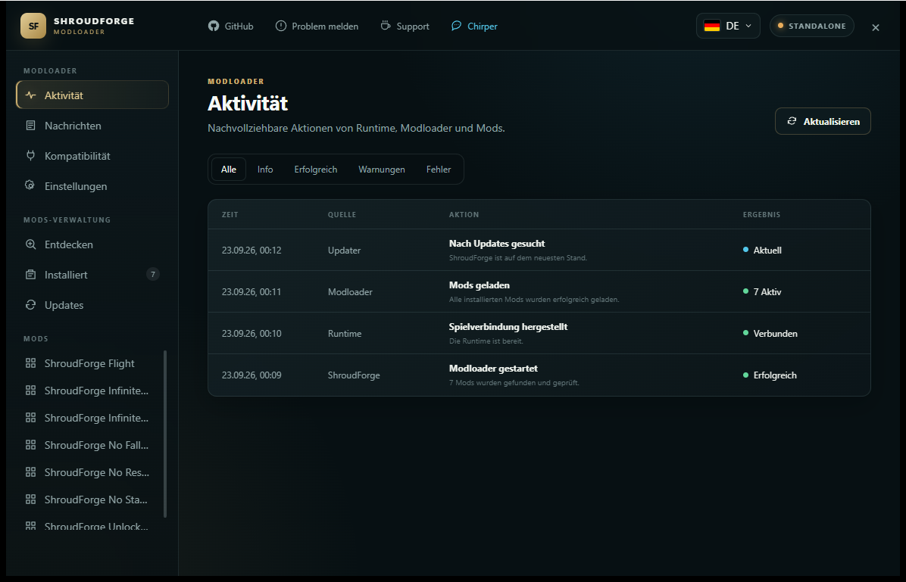

# ShroudForge

[](https://github.com/bonsaibauer/shroudforge)
[](https://github.com/bonsaibauer/shroudforge/blob/main/LICENSE)
[](https://github.com/bonsaibauer/shroudforge)
[](https://github.com/bonsaibauer/shroudforge)
[](https://github.com/bonsaibauer/shroudforge/releases/latest)
[](https://github.com/bonsaibauer/shroudforge/issues/new)


ShroudForge ist eine Modding-Plattform für **Enshrouded**. Du kannst fertige Mods
verwenden oder mit Lua eigene Mods erstellen. Alle Mods benutzen dasselbe einfache
Format: eine `mod.json` und eine `src/mod.lua`.



## Quickstart

1. Schließe Enshrouded.
2. Öffne die [neueste ShroudForge-Version](https://github.com/bonsaibauer/shroudforge/releases/latest).
3. Lade `shroudforge-<version>-<build>.zip` herunter.
4. Entpacke den Inhalt des Ordners `game` in deinen Enshrouded-Ordner. Dort liegt auch `enshrouded.exe`.
5. Starte das Spiel mit:

   ```powershell
   .\shroudforge.exe launch "."
   ```

6. Drücke im Spiel `F9`, um den Modloader zu öffnen.
7. Drücke `F10`, um die Debug Console zu öffnen.

Der typische Steam-Pfad ist:

```text
C:\Program Files (x86)\Steam\steamapps\common\Enshrouded
```

Updates werden im Modloader angezeigt. Ein vorbereitetes Update wird nach dem
Beenden des Spiels installiert. Eigene Mods, Einstellungen und Logs bleiben erhalten.

## Enthaltene Mods

| Mod | Was macht die Mod? | Läuft auf |
| --- | --- | --- |
| **Flight** | Du kannst dauerhaft fliegen. Auf Wunsch wird beim Fliegen auch Fallschaden verhindert. | Client |
| **Infinite Item Split** | Beim Teilen eines Stapels bleibt die Menge im ursprünglichen Stapel erhalten. | Client |
| **Infinite Item Use** | Benutzte Gegenstände werden wiederhergestellt und gehen nicht dauerhaft verloren. | Client |
| **No Fall Damage** | Deine Spielfigur bekommt keinen Fallschaden. | Client |
| **No Resource Cost** | Rezepte verbrauchen keine eingetragenen Ressourcen. | Client und Server |
| **No Stamina Loss** | Die Ausdauer deiner Spielfigur wird nicht weniger. | Client |
| **Unlock Blueprints** | Schaltet die unterstützten Herstellungsrezepte frei. | Client und Server |

Mods liegen im Ordner `mods`. Jede Mod kann als Ordner oder als ZIP-Datei
installiert werden. In beiden Fällen müssen `mod.json` und `src/mod.lua` direkt
im Hauptverzeichnis des Pakets liegen.

## Enthaltene Module

Module gehören direkt zu ShroudForge und sind keine Community-Mods.

| Modul | Aufgabe |
| --- | --- |
| **Modloader UI** | Zeigt Mods, Einstellungen, Meldungen und Updates. Öffnen mit `F9`. |
| **Debug Console** | Zeigt `enshrouded.log` und `shroudforge.log` mit Suche und Filtern. Öffnen mit `F10`. |
| **Commands** | Stellt den zentralen Befehlszugang für ShroudForge bereit. |
| **Updater** | Prüft und installiert vorbereitete ShroudForge-Updates nach dem Spielende. |

## API-Dokumentation

Du möchtest wissen, welche Funktionen, Spieltypen, Felder und Ressourcen du in
einer Mod verwenden kannst?

**[ShroudForge API öffnen](https://bonsaibauer.github.io/shroudforge/)**

| Bereich | Wofür ist er da? |
| --- | --- |
| `game.*` | Spieltypen, Ressourcen und Spieldaten lesen oder bearbeiten. |
| `runtime.*` | Mit der laufenden Spielwelt und ihren Komponenten arbeiten. |
| `shroudforge.*` | Logging, Einstellungen, Mod-UI und Benachrichtigungen verwenden. |

Die API-Seite enthält den aktuellen Katalog für Enshrouded-Build `1076226` mit
14.398 Typen, 42.729 Feldern und 131 Ressourcentypen.

## Deine erste Mod bauen

### 1. Ordner anlegen

```text
my-first-mod/
├── mod.json
└── src/
    └── mod.lua
```

Du kannst auch die fertige
[Lua-Vorlage](https://github.com/bonsaibauer/shroudforge/tree/main/Shroudforge_Modloader/templates/lua-mod)
kopieren.

### 2. `mod.json` erstellen

```json
{
  "id": "deinname.my-first-mod",
  "name": "My First Mod",
  "version": "1.0.0",
  "api": "^1.0.0",
  "capabilities": ["runtime"],
  "dependencies": [],
  "target": "client",
  "description": "Meine erste ShroudForge-Mod."
}
```

| Feld | Erklärung |
| --- | --- |
| `id` | Eindeutiger Name. Erlaubt sind Kleinbuchstaben, Zahlen, Punkte und Bindestriche. |
| `name` | Name, den Spieler im Modloader sehen. |
| `version` | Version deiner Mod im Format `MAJOR.MINOR.PATCH`. |
| `api` | Benötigte ShroudForge-API-Version. |
| `capabilities` | Funktionen, welche die Mod benötigt. |
| `dependencies` | Andere Mods, die zuerst installiert sein müssen. |
| `target` | `client`, `server` oder `both`. |
| `description` | Kurze und einfache Beschreibung. |

| Capability | Verwendung |
| --- | --- |
| `runtime` | Mit der laufenden Spielwelt arbeiten. |
| `assets-write` | Spielressourcen vor dem Spielstart verändern. |
| `export` | Daten aus Spielressourcen exportieren. |

### 3. Lua-Code schreiben

Speichere deinen Code in `src/mod.lua`:

```lua
shroudforge.log.info("My First Mod wurde geladen")

local enabled = shroudforge.settings.get("enabled")

if enabled then
    shroudforge.log.info("Die Mod ist aktiviert")
end
```

Eine Mod mit `runtime` läuft während des Spiels. Eine Mod mit `assets-write`
verändert Ressourcen vor dem Spielstart. Nutze die
[API-Suche](https://bonsaibauer.github.io/shroudforge/), um passende Typen und
Funktionen zu finden.

### 4. Einstellung hinzufügen

Ergänze in `mod.json` zum Beispiel einen Schalter:

```json
"settings": [
  {
    "key": "enabled",
    "type": "boolean",
    "control": "toggle",
    "label": "Mod aktivieren",
    "description": "Schaltet die Mod ein oder aus.",
    "default": true
  }
]
```

Der Modloader unterstützt Schalter, Checkboxen, Textfelder, Zahlenfelder,
Slider, Auswahllisten, Tastenbelegungen und Farben. Eine Mod kann außerdem
eigene Abschnitte, Tabs, Hinweise und sichere Button-Aktionen anzeigen. Die
vollständige Struktur steht im
[`mod.schema.json`](https://github.com/bonsaibauer/shroudforge/blob/main/Shroudforge_Modloader/schemas/mod.schema.json).

### 5. Mod testen

1. Kopiere den Mod-Ordner nach `Enshrouded\mods`.
2. Starte Enshrouded über `shroudforge.exe launch "."`.
3. Öffne den Modloader mit `F9`.
4. Prüfe die Logs mit `F10`, wenn etwas nicht funktioniert.
5. Sorge dafür, dass deine Mod beim Beenden ihren Zustand sauber zurücksetzt.

### 6. Mod als ZIP weitergeben

Die ZIP-Datei muss so beginnen:

```text
mod.json
src/mod.lua
assets/            optional
```

Lege keinen zusätzlichen Oberordner in der ZIP-Datei an. Native DLLs,
Maschinencode und eigene ausführbare Dateien gehören nicht in eine ShroudForge-Mod.

## Projektaufbau für Entwickler

| Ordner | Inhalt |
| --- | --- |
| `Shroudforge_Parser` | Liest die aktuellen Enshrouded-Daten. |
| `Shroudforge_Compatibility` | Prüft die Daten gegen den unterstützten Spiel-Build. |
| `Shroudforge_API` | Stellt die Lua-API bereit. |
| `Shroudforge_Modloader` | Lädt, prüft und startet Mods. |
| `Shroudforge_Modules` | Enthält Modloader UI, Debug Console, Commands und Updater. |
| `mods` | Enthält die mitgelieferten Lua-Mods. |
| `site` | Enthält die öffentliche API-Seite. |

### Projekt prüfen

```powershell
cargo fmt --check
cargo check --workspace
cargo test --workspace
npm run site:check
```

Das Modloader-UI wird im Ordner `Shroudforge_Modules/modloader-ui/ui` gebaut.
Übersetzungen liegen als JSON-Dateien unter `ui/src/locales`; Englisch ist die
Ausgangssprache. Der vollständige Windows-Release wird mit `build.ps1` erstellt.

## Hilfe und Fehler melden

Öffne ein [neues GitHub-Issue](https://github.com/bonsaibauer/shroudforge/issues/new)
und füge eine kurze Fehlerbeschreibung sowie die relevante Stelle aus
`shroudforge.log` hinzu.

## Lizenz

ShroudForge steht unter der
[MIT-Lizenz](https://github.com/bonsaibauer/shroudforge/blob/main/LICENSE).

## Buy Me A Coffee

If this project has helped you in any way, do buy me a coffee so I can continue to build more of such projects in the future and share them with the community!

<a href="https://buymeacoffee.com/bonsaibauer" target="_blank"></a>
