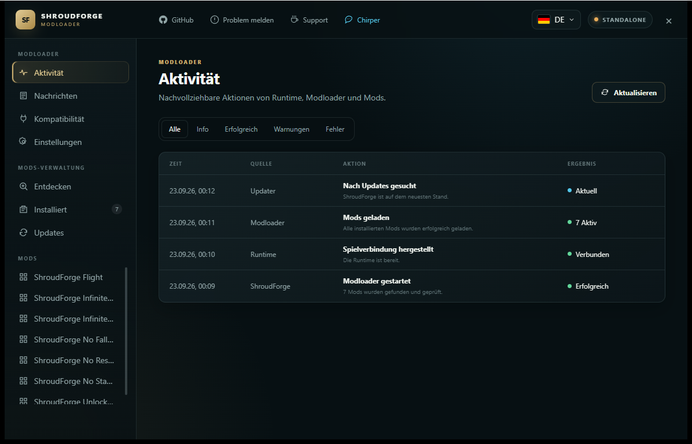

# ShroudForge

## Welcome!

ShroudForge helps you install and make mods for **Enshrouded**. A mod is a small add-on that changes or adds something in the game. You can use mods made by other players, or create your own.

New to mods? Start with the illustrated guide. It explains everything in simple steps, in English and German:

- [English: install ShroudForge, add mods, and make your first mod](https://bonsaibauer.github.io/shroudforge/en/)
- [Deutsch: ShroudForge einrichten, Mods hinzufügen und den ersten Mod bauen](https://bonsaibauer.github.io/shroudforge/de/)

The guide includes separate instructions for your PC and game server, pictures of the Modloader, a first-mod lesson, and an interactive preview for mod settings.

## Quickstart: use ShroudForge

1. Close Enshrouded.
2. Download the  
3. Right-click the downloaded ZIP and choose **Extract All**.
4. Open the Enshrouded folder that contains **enshrouded.exe**.
5. Copy the files from the ZIP into that folder, beside **enshrouded.exe**.
6. Start Enshrouded and press **F9** to open the Modloader.

A common Steam folder is:

~~~text
C:\Program Files (x86)\Steam\steamapps\common\Enshrouded
~~~

The Modloader is the ShroudForge window inside the game. It shows your mods and lets you switch them on or off. Press **F10** to read messages if something does not work.

### Add a mod

Follow the mod creator's instructions. Unpack the mod download, then copy the mod's folder into **mods**, beside **enshrouded.exe**. Its **mod.json** file should be directly inside the mod folder:

~~~text
Enshrouded/
├── enshrouded.exe
└── mods/
    └── my-mod/
        ├── mod.json
        └── src/
            └── mod.lua
~~~

Open the game, press **F9**, find the mod, and switch it on. Some mods need a game restart. Mods that change game files must prepare those changes before the game starts. Start Enshrouded through ShroudForge for those mods:

~~~powershell
.\shroudforge\shroudforge.exe launch "."
~~~

Read the full [PC quickstart](https://bonsaibauer.github.io/shroudforge/en/#play) or [server guide](https://bonsaibauer.github.io/shroudforge/en/#server) for screenshots and help with each step.

## Make your first mod

Start with the [mod template](templates/mod/README.md). It gives you the files for a small mod and explains what to change.

The website's [first-mod lesson](https://bonsaibauer.github.io/shroudforge/en/#first) walks through a complete example. When you are ready, try the [mod settings guide](https://bonsaibauer.github.io/shroudforge/en/#manifests): edit an example on the left and see the Modloader-style preview on the right. It also shows how `extended.mod.json` exposes a setting and how Lua reads it with `shroudforge.settings.get`.

To look up functions or Enshrouded game information, open the [searchable API reference](https://bonsaibauer.github.io/shroudforge/en/#api).

## Mods included in the release

The build checks mod folders for **mod.json**, a mod ID, and **src/mod.lua**, then checks the Lua files before packaging them. These are the 11 packages included in the release build today:

| Mod | What it does |
| --- | --- |
| **Fishing Data Exporter** | Saves fishing information in CSV files for community research. |
| **Item Exporter and English Translator** | Saves item information and English names in CSV files. |
| **KFC Parser Mimic** | Exports Enshrouded game data in a format similar to the KFC Parser tool. |
| **SF Infinite Item Split** | Keeps the selected amount from being removed from the original stack when splitting items. |
| **SF Infinite Item Use** | Prevents item use from consuming the item. |
| **SF No Fall Damage** | Prevents fall damage. |
| **SF No Resource Cost** | Removes the supported crafting cost. |
| **SF No Stamina Loss** | Prevents stamina from running out. |
| **SF Unlimited Flight** | Applies the supported change to flight. |
| **SF Unlock Blueprints** | Unlocks supported crafting recipes. |
| **World Editor** | Adds shortcuts for marking an area, undoing, and saving or placing blueprints. |

## What is inside the modules folder?

The folder **src/loader/modules/** contains five built-in Rust modules. They are parts of ShroudForge; they are not separate mods you need to install.

| Module | What it does |
| --- | --- |
| **Commands** | Provides a command-module entry point and reports whether it is available. |
| **Debug Console** | Shows and filters messages from Enshrouded and ShroudForge. Press **F10** in game. |
| **Modloader UI** | Lets you find, install, manage, and update mods. It also shows settings, notices, and compatibility details. Press **F9** in game. |
| **Runtime Diagnostics** | An optional, time-limited view of runtime health and mod activity. |
| **Updater** | Queues mod install and update work, and applies ShroudForge updates after Enshrouded closes. |

There is also **ui-shared**, a small folder of shared visual styles used by the user interfaces. It is not a separate running module.

The loader also has major parts outside this folder, including its API, mod package handling, compatibility checks, parser, and startup workflow. See the [developer architecture guide](docs/sf/Architecture.md) for the full map.

## For contributors

The [developer documentation](docs/sf/README.md) explains how the repository is organized and where to find the mod, runtime, parser, and Modloader content guides.

## Help and community

If something goes wrong, check the [guide](https://bonsaibauer.github.io/shroudforge/en/) and the mod creator's instructions first. If you still need help, [open an issue](https://github.com/bonsaibauer/shroudforge/issues/new). Tell us what you expected, what happened, and which game, ShroudForge, and mod versions you use. The **F10** messages can help explain the problem. Please remove private information before sharing them.

- [Report a bug](https://github.com/bonsaibauer/shroudforge/issues/new?template=bug_report.yml)
- [Suggest a feature](https://github.com/bonsaibauer/shroudforge/issues/new?template=feature_request.yml)
- [Report a compatibility problem](https://github.com/bonsaibauer/shroudforge/issues/new?template=version_mismatch.yml)

## License and support

ShroudForge is shared under the [MIT License](https://github.com/bonsaibauer/shroudforge/blob/main/LICENSE).

# Buy Me A Coffee

If this project has helped you in any way, do buy me a coffee so I can continue to build more of such projects in the future and share them with the community!

