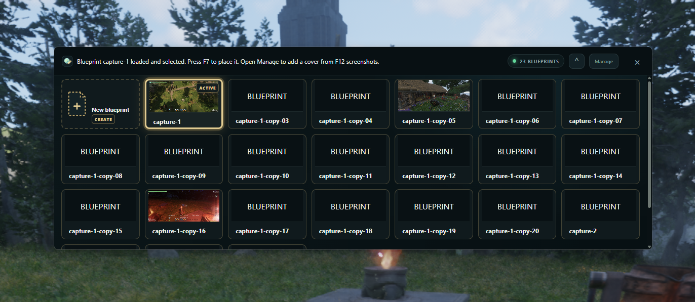

# ShroudForge

## Welcome!

ShroudForge helps you install and make mods for **Enshrouded**. A mod is a small add-on that changes or adds something in the game. You can use mods made by other players, or create your own.

New to mods? Start with the illustrated guide. It explains everything in simple steps, in English and German:

- [English: install ShroudForge, add mods, and make your first mod](https://bonsaibauer.github.io/shroudforge/en/)
- [Deutsch: ShroudForge einrichten, Mods hinzufügen und den ersten Mod bauen](https://bonsaibauer.github.io/shroudforge/de/)

The guide includes separate instructions for your PC and game server, pictures of the Modloader, a first-mod lesson, and an interactive preview for mod settings.

## Quickstart: use ShroudForge

1. Close Enshrouded.
2. Download the Latest release:
   
    
   
3. Right-click the downloaded ZIP and choose **Extract All**.
4. Open the Enshrouded folder that contains **enshrouded.exe**.
5. Copy the files from the ZIP into that folder, beside **enshrouded.exe**.
6. Start Enshrouded and press **F9** to open the Modloader.

A common Steam folder is:

~~~text
C:\Program Files (x86)\Steam\steamapps\common\Enshrouded
~~~

The Modloader is the ShroudForge window inside the game. It shows your mods and lets you switch them on or off. Press **F10** to read messages if something does not work.

### Add a mod

Follow the mod creator's instructions. Unpack the mod download, then copy the mod's folder into **mods**, beside **enshrouded.exe**. Its **mod.json** file should be directly inside the mod folder:

~~~text
Enshrouded/
├── enshrouded.exe
└── mods/
    └── my-mod/
        ├── mod.json
        └── src/
            └── mod.lua
~~~

Open the game, press **F9**, find the mod, and switch it on. Some mods need a game restart. Mods that change game files must prepare those changes before the game starts.

Read the full [PC quickstart](https://bonsaibauer.github.io/shroudforge/en/#play) or [server guide](https://bonsaibauer.github.io/shroudforge/en/#server) for screenshots and help with each step.

## Make your first mod

Start with the [mod template](templates/mod/README.md). It gives you the files for a small mod and explains what to change.

The website's [first-mod lesson](https://bonsaibauer.github.io/shroudforge/en/#first) walks through a complete example. When you are ready, try the [mod settings guide](https://bonsaibauer.github.io/shroudforge/en/#manifests): edit an example on the left and see the Modloader-style preview on the right. It also shows how `extended.mod.json` exposes a setting and how Lua reads it with `shroudforge.settings.get`.

To look up functions or Enshrouded game information, open the [searchable API reference](https://bonsaibauer.github.io/shroudforge/en/#api).

## Mods included in the release

The release build validates each mod's manifest, ID, Lua entry point, and Lua syntax. The table below lists the ShroudForge mods included in the release and the targets declared by each mod.

**Target support** means the package can be installed for that process. In multiplayer, the game process that handles an action determines where its effect must run. A checkmark does not by itself confirm that every gameplay effect has been verified end to end on a live server.

| Mod | Description | Version | Client install | Dedicated server install | Singleplayer | Multiplayer |
| --- | --- | ---: |:---:|:---:|:---:|:---:|
|  **SF Auto Stamina Refill** | Repeatedly refills stamina to maximum. | 1.1.1 | ✅ | ✅ | ✅ | ✅* |
|  **SF Infinite Item Split** | Keeps the original stack when splitting items. It also affects other inventory operations. | 1.4.0 | ✅ | ✅ | ✅ | ✅* |
|  **SF Infinite Item Use** | Prevents items from being consumed when used. | 1.1.1 | ✅ | ✅ | ✅ | ✅* |
|  **SF No Fall Damage** | Prevents health loss from falling. | 1.1.1 | ✅ | ✅ | ✅ | ✅* |
|  **SF No Resource Cost** | Removes resource consumption in supported building, crafting, and item-use actions. | 1.1.1 | ✅ | ✅ | ✅ | ✅* |
|  **SF Production Time** | Sets timed production recipes to a chosen base duration. World speed settings still apply. | 1.0.0 | ✅ | ✅ | ✅ | ✅* |
|  **SF Unlimited Flight** | Lets you keep flying without a time limit. | 1.1.1 | ✅ | ✅ | ✅ | ✅* |
|  **SF Unlock Blueprints** | Changes supported recipe unlock requirements to the first Flame Altar hint. | 1.0.1 | ✅ | ✅ | ✅ | ✅* |
|  **World Editor** | Captures, saves, rotates, and places voxel-and-prop blueprints. Uses direct world access in singleplayer and Steam P2P to send edits to a Dedicated Server in multiplayer. | 0.3.0 | ✅ | ✅ | ✅ | ⚠️ |

\* Multiplayer support depends on installing and enabling the mod in the process that handles the relevant game action. For asset changes such as recipe data or production time, prepare both client and server before starting them. A client-side change alone does not prove that the server accepted or persisted the result.

### World Editor

The World Editor can be installed on the client and Dedicated Server. The client provides the editor window, cursor selection, capture, and blueprint library. In singleplayer it uses the local world runtime; in a joined Dedicated Server world it sends the existing blueprint format over Steam P2P for the server to apply.

Blueprint placement has been observed on the Dedicated Server. **Undo for placed props is still unreliable**: the server can fail to remove a prop through the native destroy operation. Treat prop undo as experimental until it has been fixed and verified in a live session. Voxel undo and prop undo should be reported separately.

See the [World Editor guide](mods/world-editor/README.md) for controls and setup, and the [multiplayer execution notes](docs/sf/mod-multiplayer.md) for current validation details.

## Development roadmap

This table describes the current state of ShroudForge itself. **Proven** means the workflow has been verified for the stated scope. **Beta** means it is available but still has known reliability or coverage limits. **Open** means implementation or validation remains.

| Area | Current state | Status |
| --- | --- | --- |
| **Release build and mod checks** | Release packaging checks each mod's manifest, ID, Lua entry point, and Lua syntax. | ✅ Proven |
| **Build profiles** | Profiles are maintained per Enshrouded build and target. The current client profile is for build **1076226**. Supporting another build requires reviewing its profile and the operations it enables. | ✅ Proven |
| **Asset changes before launch** | Supported asset edits are prepared before the game starts. Coverage depends on the resource and game build; client and server may need matching settings. | ✅ Proven |
| **Runtime hooks and gameplay mods** | The included gameplay mods use profile-backed hooks, patches, or asset changes. Their multiplayer effect depends on which process handles the action and has not been verified end to end for every mod. | 🚧 Beta |
| **KFC runtime and ECS** | Native runtime and ECS operations are available, but live world-context detection and some read/write paths still have reliability limits. | 🚧 Beta |
| **World Editor: capture and placement** | Blueprint capture and local placement are available. Dedicated Server placement over Steam P2P has been observed. Saving and persistence still need separate live-session checks. | 🚧 Beta |
| **World Editor: prop undo** | Undo can fail when the native runtime cannot remove a placed prop. Preserve the undo journal and report the operation as incomplete; do not describe prop undo as proven. | 🕓 Open |
| **World Editor: automatic world targeting** | The client selects the local or Dedicated Server route from the detected world context. Startup, reconnect, and world-switch cases need continued live validation. | 🚧 Beta |
| **EML mod support** | ShroudForge supports documented EML-style package and API flows. Compatibility depends on the APIs and native behavior used by each mod. | 🚧 Beta |
| **Mod discovery and updater** | The Modloader can find and install catalog mods, queue mod updates, and stage ShroudForge updates with backups. Broader recovery scenarios still need validation. | 🚧 Beta |
| **More game builds and server profiles** | Add and validate profiles for further Enshrouded builds and targets. | 🕓 Open |
| **Stable ECS-backed mod API** | Make world-context detection and ECS access dependable, then document supported operations based on live verification. | 🕓 Open |

## License and support

ShroudForge is shared under the [MIT License](https://github.com/bonsaibauer/shroudforge/blob/main/LICENSE).

# Buy Me A Coffee

If this project has helped you in any way, do buy me a coffee so I can continue to build more of such projects in the future and share them with the community!

