# Projektrefactor: klare Produktgrenzen und ein gemeinsamer Ausführungsweg

Stand: 9. Oktober 2026. **Vorschlag für einen tatsächlichen Architekturumbau.**

Dieser Plan ersetzt den vorherigen Plan. Insbesondere war dessen Entscheidung falsch, `world-editor-ui` als eingebauten Fensteradapter zu behalten: Dieser Code besitzt auch Blueprintverwaltung, Screenshotzuordnung und eine zweite Oberfläche. Solche Mod-Sonderfälle müssen aus dem Produktkern verschwinden.

Das Produkt ist eine **Modplattform für externe Autoren**. Der Loader stellt allgemeine Schnittstellen, einen Ingame-UI-Rahmen und ein nutzbares SDK bereit. Modautoren liefern ihre Oberflächen und Fachfunktionen als vollständige Pakete. Eine neue Modfunktion darf keinen entsprechenden Einbau in den Loader voraussetzen.

Das Ziel ist: **Eine Funktion hat einen fachlichen Besitzer. Eine Mod ist als Paket vollständig. UI, CLI und Dateibefehle verwenden dieselbe Ausführung. Konfiguration, Formulare und Referenz beschreiben denselben Vertrag.**

## Schnellüberblick

- **Produkt:** ShroudForge stellt allgemeine Modloader-Infrastruktur bereit. Die Desktop-Modloader-UI ist ihr Verwaltungsclient; sie ist nicht selbst die Modplattform.
- **Erweiterungen:** Eingebaute Produktmodule gehören zum Loaderbuild. Community-Mods sind vollständige installierbare Pakete. SDK-Dienste sind die einzigen allgemeinen Anschlüsse zwischen beiden.
- **Struktur:** Ein `mod.json` und ein gemeinsamer Config-/Command-/Lifecycleweg. EML, Lua-API, Manifest und öffentliche UI-Schnittstelle haben jeweils ihre eigene Versionsfamilie und liegen samt eigener Logik unter dieser Familie. Es gibt keine übergeordnete `platform/v1`-Version.
- **Laufweg:** Paket installieren → prüfen → planen → passende Asset-/Runtimejobs starten → API, Commands, Settings und paket-eigene Views bereitstellen → Status/Ergebnis liefern → sauber entladen. Jeder Schritt hat einen Besitzer und einen sichtbaren Fehlergrund.
- **Arbeitsfolge:** A0 → A3 → A6 → A7 → A1 → A8 → A4 → A2 → A5 → A9 → A10 → A11. Details und Abnahmen stehen in Abschnitt 11.
- **Beispiele:** Der Updater zeigt eine eingebaute Produktfunktion. Eine kleine fremde Mod zeigt den allgemeinen SDK-Vertrag. World Editor ist der große Konformitätstest und bestimmt keine Loader-Sonderregeln.

Zum Einstieg: [Zielstruktur](#3-zielstruktur-nach-fachlichem-besitz), [Ladeweg](#mod-ladeweg-mit-besitzer-und-sichtbarem-ergebnis), [Abarbeitungsplan](#11-arbeitsaufträge-mit-ergebnis-und-löschung) und [Änderungseinstiege](#12-wo-eine-konkrete-änderung-danach-hingehört).

## Gesamtsystem: Wer macht was, wann?

ShroudForge ist ein Programm, das Erweiterungspakete in einen konkreten Spielprozess einbindet. Es besteht aus sechs klar verschiedenen Teilen:

| Teil | Was er tut | Darf dort liegen | Darf dort nicht als Sonderfall liegen |
|---|---|---|---|
| **Anwendungen und Prozesse** | Starten Desktop, CLI, Runtime, Updater und Installerworker; verbinden die nötigen Teile | Argumente, Betriebssystem, Prozessstart und Zusammensetzen | Regeln für einzelne Mods oder doppelte Featurelogik |
| **Core** | Entdeckt Pakete, erzeugt den Laufplan, verwaltet Lifecycle, Befehle, Settings und Zustand | Generische Mod-/Control-Verträge und Identitäten | Spieldateiformate, Produktfeaturebedienung, Namen einzelner Mods |
| **Eingebaute Produktfunktionen** | Liefern ShroudForge-eigene Funktionen wie Updater, Diagnose und Logansicht | Ihre Regeln, Befehle, Settings und eigene Produktansichten | Verkleidete Community-Mods oder Funktionalität, die nur ein Modpaket braucht |
| **Modpaket** | Liefert eine Community-Erweiterung vollständig aus | Mod-Lifecycle, eigene Lua-/Nativefunktion, eigene UI, Ressourcen, Settings und Befehle | Loader-Code, globales Settingsfeld oder einen Produktbuild für die eigene Oberfläche |
| **API/SDK und UI-Host** | Bieten unterstützte Anschlüsse, Vorlagen, Controls, Bridge und allgemeine UI-Flächen | Renderer, Paketidentität, Nachrichten und allgemeine Controls | Blueprint-, Screenshot-, Inventar- oder sonstige Modfachlogik |
| **Spieladapter** | Übersetzt die öffentliche API in geprüfte Spiel-, KFC- und ABI-Operationen | Spielbuildprofile, Parser, native Bindings und deren Belege | Updater, Website, Modautoroberfläche oder die Bedeutung einzelner Mods |

Der Umbau ist ausdrücklich auf **weniger aktiven Produktcode und weniger Implementierungen pro Funktion** ausgelegt. Dateien bloß umzubenennen, zu verschieben oder in neue Fassaden zu packen zählt nicht als Reduktion. Für jeden Arbeitsauftrag werden vorher/nachher gezählt: aktive eigene Produktionszeilen (ohne generierte Dateien, Fixtures und Drittanbieterquellen), vorhandene parallele Implementierungen und die danach gelöschten Zeilen/Pfade. Eine neue gemeinsame Infrastruktur wird nur akzeptiert, wenn sie konkrete doppelte Handler, Parser, UI-Sonderfälle oder Configlisten ersetzt; die Summe aktiver Produktionszeilen über alle Aufträge muss sinken, ohne einen zugesicherten Funktionsfall zu verlieren.

`Cargo crate`, `Rust-Modul`, `eingebautes Produktmodul`, `Community-Mod` und `SDK-Dienst` sind verschiedene Begriffe. Ein Crate ist Buildstruktur. Ein eingebautes Produktmodul ist statisch registrierter ShroudForge-Code mit eigener Fachverantwortung. Eine Community-Mod ist ein installierbares Paket außerhalb des Produktbuilds. Ein SDK-Dienst ist eine dokumentierte, allgemeine Schnittstelle, die Mods verwenden dürfen. Ein Ordnername oder `module.json` macht Code nicht dynamisch ladbar.

Für jede Erweiterungsanforderung gilt diese Zuordnung:

| Wenn die Funktion … | Dann gehört sie … | Beispiele |
|---|---|---|
| jede Mod für Laden, Berechtigungen, Zustand oder Bedienung braucht | in Core bzw. den allgemeinen SDK-/Hostvertrag | Paketprüfung, Lifecycle, Commands, Settings, UI-Bridge |
| nur ShroudForge als Produkt braucht | in ein eingebautes Produktmodul | System-Updater, Kataloganbieter, Diagnose, Logansicht |
| nur eine installierbare Community-Erweiterung braucht | vollständig in deren Modpaket | World Editor, automatische Beute, eigene Werkzeuge und Ansichten |
| ein konkretes Spielbuild oder ABI voraussetzt | in den Spieladapter mit Beleg | KFC-Parser, ECS-Layout, Hook, Game-thread-Aufruf |
| Prozesse startet oder Komponenten zusammenstellt | in die Anwendung bzw. den Composition Root | CLI, Desktopstart, Runtime-FFI, Updateworker |

Kein Modname, keine Modfachdatei und kein Modhandler darf in Core, Host, gemeinsamem SDK oder Website fest eincodiert werden. Eine eingebaute Funktion darf allgemeine SDK-Dienste verwenden, bekommt aber keinen privaten zweiten Ausführungsweg.

### Der verbindliche Laufweg einer Mod

```text
Paket entdecken
  → Format prüfen und in ein internes Modmodell einlesen
  → Aktivierung, Version, Abhängigkeiten, Capability und client/server-Ziel prüfen
  → einen Modplan mit getrennten Aufgaben für Asset, Runtime und UI erzeugen
  → erlaubte Assetaufgaben transaktional vor dem Spiel ausführen
  → Runtimemod im passenden Spielprozess laden und öffentliche API anbinden
  → Modansicht im allgemeinen UI-Host öffnen; UI-Dateien aus diesem Paket laden
  → UI/CLI/Dateibefehl an denselben deklarierten Modbefehl leiten
  → Modhandler, API und bei Bedarf Spieladapter ausführen lassen
  → Ergebnis und Bereitschaft von den jeweiligen Besitzern zurückmelden
  → beim Update/Entladen Arbeit beenden, Modansicht schließen, Ressourcen freigeben
```

Der Planer zeigt pro Mod **warum** ein Paket erkannt, ausgewählt, übersprungen oder blockiert wurde und welcher Schritt gerade läuft. `client`/`server`, `pregame`/`ingame`, Capability, Spielbuild-Unterstützung und momentane Bereitschaft sind getrennte Werte. Der Prozessname beweist keine Netzwerkautorität; Singleplayer und lokales Hosting laufen weiter im Clientprozess.

### Prozess- und Aufgabenverteilung

| Laufzeitort | Lädt | Führt aus | Lädt ausdrücklich nicht |
|---|---|---|---|
| Desktop/Modloader-Ansicht | Core, Desktopnavigation und eingebaute Produktansichten | Einstellungen lesen, Befehle an den Besitzer übergeben, Status darstellen | beliebige Spielhooks direkt im Fenstercallback |
| Client-Spielprozess | Gameadapter, Runtimemodplan und freigegebene Clientmodpakete | Lua-Lifecycle, clientseitige Operationen, Spielthread-Aufgaben und Ingame-UI-Anbindung | Updaterfenster oder Dedicated-Serverstatus als Clientbeweis |
| Dedicated-Server-Spielprozess | Gameadapter und freigegebene Servermodpakete | Servergeeignete Runtimebefehle im Serverkontext | WebView, Cursor, lokaler Dateidialog oder eine Clientoberfläche |
| Updater-/Installationsworker | Updatevertrag, Paketstore und explizite Jobs | Release prüfen, herunterladen, validieren, warten, installieren und wiederherstellen | Mod-Runtime oder Editor UI |
| Website/Modeditor | dasselbe SDK, dieselben Paketschemas und Vorlagen | Modpakete erstellen, prüfen und in Vorschau darstellen | einen zweiten API-Vertrag oder echte Spielwirkung vortäuschen |

Ein gemeinsamer Befehlsvertrag bedeutet gemeinsame **Deklaration, Validierung, Handler und Ergebnisform**. Die jeweilige Anwendung vermittelt zu diesem Handler: Desktop/CLI sprechen den Installationscontroller an; ein Runtimebefehl wird an die adressierte Spielinstanz zugestellt; ein Serverdateiauftrag wird im Serverprozess angenommen. Keine Oberfläche führt ihren eigenen Updater oder Modhandler aus. Bei nicht erreichbarer Runtime ist der Auftrag wartend oder abgelehnt, nicht fälschlich erfolgreich.

### Eine Quelle für Vertrag, Zustand und Darstellung

```text
Besitzervertrag → validierter gespeicherter Wert → effektiver Laufzeitwert
              ├→ UI-Formular
              ├→ CLI-/Dateioberfläche
              ├→ Status/Diagnose
              └→ SDK-Referenz und Websiteformular
```

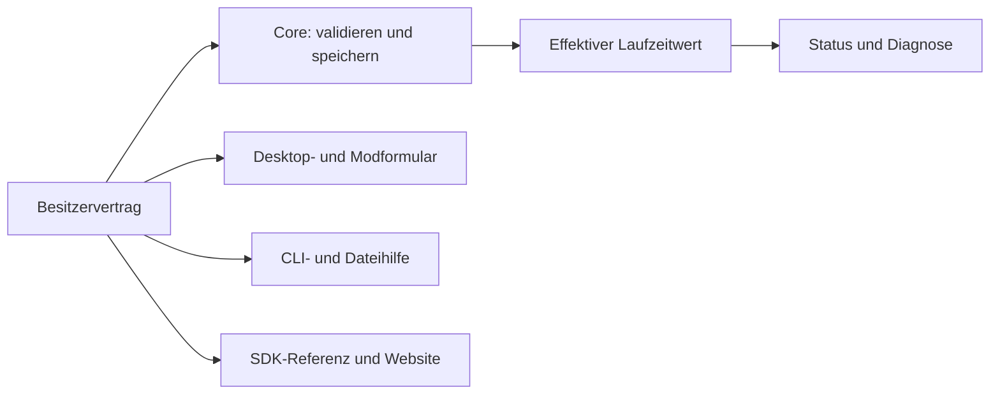

Der Vertrag gehört der Funktion oder Mod, die den Wert auswertet. Core speichert und validiert generisch. Ein Setting ist Definition plus benutzerseitiger Wert; laufender Jobfortschritt ist Status, kein Setting. Ein UI-Button referenziert einen registrierten Befehl und enthält keine eigene Aktionsimplementierung. Befehl, Setting, View und Capability haben eindeutige Eigentümer und Versionen. Generatoren vervielfachen keine handgepflegte Wahrheit.

Capabilities beschreiben die Erlaubnis/Absicht des Pakets. Der Planer prüft Prozessziel und Phase. Der Spieladapter meldet, ob der konkrete Build und die benötigte Operation unterstützt werden. Der aktuelle Runtimekontext meldet, ob sie **jetzt** bereit ist. Diese Fakten werden gemeinsam angezeigt, bleiben aber im Modell verschieden. Nativer Modcode bleibt nativer Prozesscode und wird durch Lua-Capabilities nicht zu sandboxed Code.

### Versionsregel

Versionen gehören zu dem jeweiligen öffentlichen Interface, das sie beschreibt. EML, ShroudForge-Lua-API, Paketmanifest und Mod-UI-Vertrag haben voneinander unabhängige Versionsnummern. Es gibt keine gemeinsame `platform/v1`, die diese Verträge künstlich koppelt.

```text
src/platform/
  api/
    eml/
      v1/              # vollständige EML-v1-Bindings, Typen, Referenz und Beispiele
    lua/
      v1/              # vollständige ShroudForge-Lua-API-v1-Bindings und Referenz
  manifest/
    v1/                # unabhängiges mod.json-Schema/Reader-Vertrag, falls Manifest v1
  ui/
    v1/                # unabhängiger öffentlicher View-/Bridgevertrag, falls UI-v1
  sdk/                 # Generatoren und Werkzeuge, die konkrete Verträge konsumieren
src/core/              # interne Laufzeit- und Speicherlogik ohne Vertragskopien
src/games/...          # Spielprofile und ABI-Belege nach Spielbuild
examples/mods/<id>/    # vollständige Modpakete als ausführbare Beispiele
```

Jede unterstützte Version enthält ihren vollständigen öffentlichen Vertrag: Bindings/Implementierung, Definitionen, Tests, Beispiele und Dokumentation. Ist nur v1 aktiv, wird v1 direkt gepflegt und nicht mit einem v2-Adapter ummantelt. Wird eine zweite Version tatsächlich gleichzeitig unterstützt, liegt deren vollständige Implementierung und Referenz unter demselben Familienordner als `v2/`; die Mod wählt ihre API-Familie und Version ausdrücklich. Nicht unterstützte Versionen werden gelöscht und nicht als tote Kompatibilitätsschicht behalten. Gemeinsame interne Runtime- oder Spieladapterlogik bleibt außerhalb der Versionsordner und wird nur geteilt, wenn die Abstraktion tatsächlich Implementierungen einspart. `src/platform` selbst hat keine Versionsnummer. Das Manifest bleibt im Ziel dieses Plans v1 und wird direkt aktualisiert.

Für diesen Umbau wird das aktuelle `mod.json` direkt aktualisiert und weiter als Manifest v1 bezeichnet; alte Paketformate und Parseradapter werden entfernt. EML v1 und Lua-API v1 werden unabhängig weiterentwickelt. Ein Lua-API-Änderungsschritt muss keine EML-Version erzeugen, und eine EML-Änderung darf keine Manifestversion ändern. Eine zusätzliche Interfaceversion entsteht nur bei einem echten Vertragsschnitt, wird vollständig im eigenen Versionsordner implementiert und nicht mit anderen Familien gebündelt. Nur tatsächlich unterstützte Versionen werden gebaut; es gibt keine bloßen Wrapper oder automatische Altversionsmigration. Website und Modloaderformulare lesen für jedes Interface separat die passende Definition.

### Was der Modloader als Infrastruktur anbietet

Der Modloader bietet ein kleines, vollständiges Set allgemeiner Dienste. Jeder Dienst hat einen benannten Besitzer, einen Vertrag, einen gemeinsamen Aufrufweg und dokumentierte Ergebnisse. Neue Modfunktionen entstehen durch Kombination dieser Dienste im Paket der Mod.

| Infrastrukturvertrag | Was Modautoren damit tun können | Besitzer im Loader |
|---|---|---|
| Paket und Manifest | Mod eindeutig beschreiben, Einstiege, Prozessziele, Capabilities, Settings, Befehle und Views deklarieren | `core/mods` und `platform/manifest/v1` |
| Installation und Paketstore | Verzeichnis/ZIP prüfen, installieren, aktualisieren, entfernen und Transaktionen nachvollziehen | `core/mods/package_store` |
| Plan und Lifecycle | sehen, wann und warum ein Mod ausgewählt, geladen, blockiert, entladen oder neu gestartet wird | `core/mods` und `core/runtime` |
| Öffentliche Runtime-API | dokumentierte Spiel-, Asset-, Datei- und Modzustandsoperationen aufrufen | jeweilige Familie unter `platform/api/<family>/<version>`, implementiert durch Core und Spieladapter |
| Capability und Bereitschaft | Erlaubnis, Ziel, Phase, Buildunterstützung und momentane Bereitschaft unterscheiden | `core/runtime` und Spieladapter |
| Settings | Definitionen darstellen, Werte validieren/speichern und Live-/Neustartstatus anzeigen | Modvertrag plus `core/settings` |
| Commands und Jobs | Modaktion über UI, CLI oder Serverdatei mit denselben Parametern, Prüfungen, Status und Ergebnis ausführen | `core/control` plus Modhandler |
| UI-Host und SDK | paket-eigene Views laden, allgemeine Controls, Fokus, Ressourcen und Modbridge verwenden | `core/ui_host` und unabhängig versioniertes `platform/ui/<version>` |
| Status und Diagnose | Plan, Ladephase, Blockierungsgrund und Jobergebnis abfragen | jeweiliger Besitzer; zusammengefasst durch Core |

Der Loader verspricht nur Funktionen, die im aktiven Vertrag implementiert und dokumentiert sind. Er verspricht weder ein erfundenes Server-RPC noch Enginefunktionen, für die kein Spielbuildbeleg vorliegt. Modautoren dürfen eigene Dateiformate, UI und Fachlogik definieren, müssen dafür aber keine produktspezifischen Loaderänderungen erhalten.

Die ShroudForge-Modloader-Desktopoberfläche ist ein Verwaltungsclient für diese Verträge, nicht die Definition der Modloader-Infrastruktur. Sie rendert registrierte Mod-/Produktverträge und reicht Befehle an deren Besitzer. Der World Editor ist eine Beispielmod und ein anspruchsvoller Verbraucher; keiner von beiden bestimmt die allgemeine Architektur.

Ein gewöhnliches Modpaket sieht im einfachsten Fall so aus; nicht benötigte Ordner werden weggelassen:

```text
mods/<id>/
  mod.json            # einziger Paketvertrag
  src/mod.lua         # deklarierter Runtimeeinstieg, falls die Mod Runtime nutzt
  ui/                 # eigene Views, falls die Mod eine Oberfläche anbietet
  assets/             # Modressourcen oder Assetdateien, falls benötigt
  native/             # native Erweiterung, nur falls ausdrücklich benötigt
  README.md           # Autorhinweise, Voraussetzung und Beispielaufruf
```

Es gibt keinen zweiten UI-Ordner im Loader für Modoberflächen, keine globale Modliste im UI-Code und keine parallelen Configdateien pro Eingang. Beispiele liegen ausschließlich unter `examples/mods/`; die Plattformdefinition enthält Vertrag, Generator/Vorlage und Referenz, nicht eine zweite Kopie eines Beispielpakets.

### Mod-Ladeweg mit Besitzer und sichtbarem Ergebnis

| Schritt | Besitzer | Ergebnis, das Nutzer und Maintainer sehen | Fehlerverhalten |
|---|---|---|---|
| Installieren/aktualisieren | `core/mods/package_store` | installierte Paketrevision und Transaktionsstatus | ungültiges Paket wird vor dem Ersetzen mit Pfad und Grund abgelehnt |
| Entdecken und Einlesen | `core/mods/discover` / `manifest` | Mod-ID, Manifestrevision und gefundener Einstieg | ein Schemafehler zeigt Datei, Feld und Erwartung; kein partielles Laden |
| Planen | `core/mods/plan` | Auswahl, Zielprozess, Phase, Abhängigkeiten, Capability und Ausschlussgrund | deaktiviert, falsches Ziel, Konflikt oder fehlende Abhängigkeit erhalten stabile Gründe |
| Assets vorbereiten | Assetadapter | geplanter Datei-/Assetjob, Backup, Fortschritt und Commitstatus | Fehler führt zur Rücknahme oder zu einem expliziten Recoverystatus |
| Runtime starten | `core/runtime` und Spieladapter | konkrete Instanz, Prozessrolle, Spielbuild und Lifecyclephase | fehlender Provider/Buildbeleg blockiert nur die betroffene Operation mit Grund |
| Mod initialisieren | Mod-Lifecycle | Einstiegsergebnis und registrierte Commands/Settings/Views | Initialisierungsfehler verhindert Ready und lässt andere Mods weiterlaufen, sofern unabhängig |
| Ansichten und Eingänge binden | allgemeiner UI-/Command-Host | paketgebundene View, Settingsformular und erreichbare Commands | kein stiller Fallback auf eine Loaderansicht mit Modfachlogik |
| Betrieb | zuständiger Modhandler/API-Dienst | Bereitschaft, Jobfortschritt, Resultat und Diagnose | nicht erreichbares Ziel bleibt wartend/abgelehnt, nicht erfolgreich |
| Deaktivieren/aktualisieren/beenden | `core/runtime` und Paketstore | Commands gesperrt, Views geschlossen, Mod entladen bzw. Neustartbedarf angezeigt | alte Instanz-ID kann nach Wechsel keine Befehle mehr empfangen |

Alle Anwendungen zeigen dieselbe Mod-ID, denselben Phasenstatus und denselben Fehlercode. Die Desktop-UI formatiert diesen Status; sie erfindet keine eigene Ladeentscheidung.

### Zwei konkrete Änderungsfälle

| Änderung | Fachlicher Besitzer | Gemeinsame Infrastruktur | Gleicher Effekt auf weitere Eingänge |
|---|---|---|---|
| Updater soll Tags anders wählen | `modules/system-updater/providers/github-releases/` | Controlvertrag, Systemupdatejob und Worker | Desktop, Updaterfenster und CLI erhalten dieselbe Releaseentscheidung. Updater-EXE ändert nur Start/Workerübergabe. |
| Neue Community-Mod bekommt Ingame-UI | Das installierbare Modpaket: Manifest, Luahandler, `ui/` und Ressourcen | Standard-UI-Rahmen, Controls, paketgebundene Bridge, dokumentierte Spiel-/Datei-API | Modloaderliste und Spielansicht entdecken/öffnen die deklarierte View. Keine Loadercrate, globale Configliste oder Website-Sonderregel für den Modnamen. |

Die nachfolgenden Editor-, Updater-, Config-, API- und Websitebeispiele belegen jeweils **diese** Besitzregeln. Sie sind Teil der Systemprüfung, nicht die Definition des Gesamtauftrags.

## 1. Befund und Prüfumfang

Das [Dateiinventar](refactor-file-inventory.csv) enthält 471 Einträge einschließlich zwei Submodulen. Darunter sind 237 eigene Quelltextdateien mit 61.657 aktuellen Zeilen. Jede erfasste Datei hat einen vorgesehenen Besitzer, eine Behandlung und einen Zielpfad bzw. benannte Teilziele. Für Dateien sind SHA-256 und Zeilenzahl erfasst; 236 von 237 Quelltexten wurden vollständig Zeile für Zeile gelesen. `mods/world-editor/src/mod.lua` änderte sich während dieser Dokumentationsprüfung weiter; der Inventareintrag kennzeichnet die aktuelle Fassung als erneut vollständig zu prüfen, bevor A5 beginnt.

**Prüfstand:** Die frühere manuelle Zeilenprüfung deckt 236 der 237 Quelltextdateien ab. `review` und `review_detail` markieren die aktuelle World-Editor-Datei ausdrücklich als während der Prüfung geändert und erneut vollständig zu lesen. Die aktuelle World-Editor-Datei hat SHA-256 und Zeilenzahl im Inventar, ist aber wegen laufender Änderungen ausdrücklich nicht als aktuell vollständig geprüft markiert. Die übrigen 234 Inventareinträge umfassen Dokumentation, Generatoren, Katalogdaten, Binärdateien und Submodule und sind nach ihrem jeweiligen Prüfstatus markiert. Die Befunde unten sind Architektur- und Reduktionsvorschläge, keine Aussage über vollständige Fehlerfreiheit.

Der Arbeitsbaum enthält bereits Änderungen an vielen dieser Dateien. Das Inventar beschreibt den während der Untersuchung erfassten Bestand. Vor einem Umbau werden Hash und aktueller Diff erneut abgeglichen; vorhandene Änderungen werden übernommen, nicht zurückgesetzt.

### Manuelle Befunde zu API, Runtime und Paket-Infrastruktur

Die aktuelle API enthält wertvolle Funktionalität, aber auch konkrete Wiederholungen und offene Semantik, die der Umbau ausdrücklich bewahren und bereinigen muss:

| Gelesene Stellen | Nachweis | Refactorauftrag |
|---|---|---|
| `env/game/assets/value/converter.rs`, `validator.rs` | Zwei getrennte, große `PrimitiveType`-Matrizen verarbeiten dieselben numerischen, Enum-, Array-, Struct-, Optional- und Variantwerte. Vier native `Ds*`-Varianten enden in beiden Dateien mit `todo!()`. | Eine gemeinsame Typbehandlung für Validierung, Klonen und KFC-Konvertierung; keine zweite handgepflegte Typmatrix. DS-Werte bleiben bis zu belegter Engine-Ownership ausdrücklich als nicht unterstützte Typen ausgewiesen und dürfen nicht durch Panics scheitern. |
| `env/game/assets/value/simple.rs`, `mapped.rs` | Eigene und KFC-gemappte Structs/Arrays/Varianten duplizieren Zugriff, Iteration, Klonen, Typprüfung und Dirty-Ermittlung. Gleichzeitig bewahrt der gemappte Pfad Originalbytes und entscheidet, welche Änderungen geschrieben werden. | Ein Lua-Wertmodell mit klarer `owned`- oder `mapped`-Speicherung und gemeinsamen Operationen. Originalbytes, Lazy-Zugriff, Dirty-Zustand und Konfliktschutz bleiben als explizite Datenregeln erhalten. |
| `simple.rs` | Setter für Struct- und Arraywerte validieren aktuell gegen den äußeren Typ; gemappte Varianten validieren gegen Feld-/Elementtyp. | Vor dem Umbau Verhalten charakterisieren; Setter und Testvertrag auf den tatsächlichen Feld-/Elementtyp festlegen. Keine der falschen Prüfregeln beim Zusammenführen fortschreiben. |
| `env/integer.rs`, `eml/v1/definitions/integer.lua` | Rust erzeugt die acht Breiten bereits über Makros; daneben enthält die manuell gepflegte Lua-Definition 2.446 wiederholte Zeilen für dieselben Methoden. Der `u64`-Clamp passt seine Maximalgrenze auf einen negativen Lua-Integer ab. | Die v1-Methodenliste nur einmal pflegen und Referenz daraus erzeugen; die statischen Wiederholungsblöcke löschen. Alle acht Breiten und insbesondere unsigned 64-bit separat charakterisieren. |
| `env/buffer.rs`, `env/buffer/read.rs`, `env/buffer/write.rs` | Für jeden Skalar wiederholen sich Lua-Registrierung, Argumentumwandlung sowie endianabhängiges Lesen/Schreiben. | Gemeinsame kleine Read-/Write-Primitiven für Bytes und Endian-Werte; öffentliche Methodennamen und Fehlerverhalten aus einem Vertrag ableiten. Keine zusätzliche Buffer-Abstraktionskette. |
| `eml/v1/definitions/buffer.lua`, `env/buffer/order.rs`, `env/buffer/read.rs` | Die Referenz erlaubt `ByteOrder = "default" | "big" | "little"`, die Runtime-Konvertierung akzeptiert nur `big` und `little`. Die Definition dokumentiert außerdem `read_resource` als head-verschiebend; die Implementierung liest ohne den Cursor fortzuschieben. | Definition und Implementierung als einen Vertrag behandeln. Vor der v1-Umstellung gewünschte Semantik festlegen, dann Lua-Referenz, Runtime und Beispiele gemeinsam angleichen. |
| `env/table.rs`, `env/mod.rs` | Die API ersetzt global `table.insert` und `table.remove` und ergänzt `table.clear`, damit spezielle KFC-Userdata wie normale Listen wirken. | Collectionoperationen sichtbar am API-Wertmodell registrieren; die globale Standardbibliothek bei der v1-Umstellung nicht heimlich verändern. Modcode und Beispiele gleichzeitig auf die eine explizite Form umstellen; keine alten Aliaswege behalten. |
| `env/runtime_attributes.rs` | `read_attribute`/`read_attributes`, `write_attribute_storage`/`update_attribute` und `evaluate_attributes` teilen Berechtigungs-, Scalar-, Layout- und Providerprüfungen, haben aber verschiedene Effekte. Einige Writes rechnen einen ganzen Attribut-Root neu und nutzen Compare-Exchange; andere schreiben einen einzelnen Speicherwert. | Ein gemeinsamer klarer interner Ablauf mit ausdrücklich benannten Modi für Lesen, Simulieren, Rohspeicher-Schreiben und Neuberechnung. Sichtbare Befehle benennen ihre Wirkung; Clientlokalität wird nie als Multiplayer-RPC ausgegeben. |
| `env/io.rs` | `read` und `read_to_string` duplizieren Datei-I/O. `export` schreibt direkt, während Export-Lesen/Kopieren/Verschieben/Entfernen über kanonische Pfadprüfungen laufen. | Ein Lesenpfad und eine gemeinsame begrenzte Exportpfadprüfung für alle Operationen. Moddateizugriff und Exportzugriff bleiben unterschiedliche Eigentümer/Capabilities, aber mit klarer API-Zuordnung. |
| `env/image.rs`, `env/image/value.rs` | Die Mipmap-Angabe in `decode_texture` wird ignoriert; Größenberechnung nutzt `width * height * 4`, die KFC-Decodierung unwrappt, und Fehlergrenzen für Bilder mit Dimension 0 rechnen `dimension - 1`. | Bestehende allgemeine Bild-API behalten und die dokumentierten Eingaben, Grenzfälle sowie Fehler als Abnahmepunkte festhalten. World-Editor-Screenshot- und Coverfachlogik bleibt dennoch Modcode. |
| `env/loader.rs` | Die aktuelle 3.178-Zeilen-Datei baut fast die ganze Runtime-Lua-API, Capability-/Phase-/Providerentscheidungen, ECS-/World-Umwandlungen und den Windows-KFC-Runtime-ABI-Zugriff zusammen. Abfragen wie `has`, `status`, `require`, `get_operations`, `get` und `bind` berechnen Verfügbarkeit mehrfach; Tabellenaufbau für Prop-Transformdaten ist wiederholt. | Ein Runtimevertrag besitzt pro Operation Capability, Phase, API-Version und Providerbereitschaft an einer Stelle. Allgemeine Lua-Registrierung/Validierung und Enshrouded-Provider liegen bei ihren tatsächlichen Besitzern. Gleiche Resultformate mit einem Serializer erzeugen; alle derzeitigen Gründe und Fehlerfälle erhalten. |
| `env/app_state.rs`, `lib.rs` | `AppState` mischt Prozesskonfiguration, Capabilityflags, Assetreader/-writer/-Transaktion, Resource-/Typecache, Runtimestatus und nativen DLL-Import. `lib.rs` mischt Pregame-Assetausführung/-commit mit Lifecycle, Livekonfigurationsbeobachtung, Reload, Diagnose und Statusdateien. | Laufzeitcontroller, Assetjob und Spieladapter als getrennte Verantwortliche mit einem Ablauf besitzen lassen. Prozessstart stellt nur konkrete Abhängigkeiten bereit; Zustandsänderung und Commit bleiben beim passenden Job. |
| `env/runtime_functions.rs`, `env/loader.rs` | Die öffentliche Funktion `list` ist ein Alias von `list_native`, `get_native` ein Alias von `get`. Dieselben Operationen werden außerdem in Katalog-JSON, Lua-Definition, Capability-Match und Website-Referenz einzeln abgebildet. | Im aktualisierten v1-Vertrag je Funktion einen öffentlichen Namen und eine kanonische Operationsdeklaration führen. Entfernte Aliase im selben v1-Schnitt aus Mods, Referenz und Website entfernen; API-Definition und Referenz aus einer Quelle erzeugen. |
| `shroudforge/v1/shroudforge.rs`, `lib.rs` | UI-Aktionen laufen als JSON-Dateien durch `ui_data_dir/actions`; der Runtimepoller liest/validiert/löscht diese Dateien und sucht Lua-Callbacks im Registry. Das ist ein versteckter zweiter Auftragskanal mit eigener Persistenz und Statuslogik. | UI-Host und Runtime über den allgemeinen adressierten Befehlskanal verbinden. Mod darf Handler registrieren, Host darf den Handler aufrufen; Dateipolling und getrennte Actionpayload-Logik entfallen. |
| `package/registry/mod.rs` | Die öffentliche Manifestvalidierung lädt die Link-ID-Liste direkt aus `modules/modloader-ui/ui/src/links/order.json`. Ein Paketvertrag hängt so an einer konkreten UI-Quellstruktur. | Link-IDs und übrige öffentliche Felder in einem v1-Paketvertrag besitzen; UI rendert diesen Vertrag. Validator, Website und UI beziehen ihre Felder aus derselben Definition. |
| `package/paths.rs`, `package/prepared.rs`, `api/load.rs`, `package/backups.rs` | `prepared` identifiziert die Spiel-EXE per Länge und Änderungszeit; `load.rs` hält genau diese Werte ausdrücklich für keine ausführbare Identität und benutzt SHA-256. Backupverzeichnisse verwenden wiederum Größe und Änderungszeit in Sekunden als Build-Schlüssel. | Einen zentralen Buildbeleg aus EXE-Inhalt, Zielprozess und KFC-Version bereitstellen und für Cache, Vorbereitung und Originalbackup verwenden. Berechnung cachen, aber nie Dateizeit als Buildidentität ausgeben. |
| `package/status.rs` | Eine 469-Zeilen-Statusfunktion liest und interpretiert News, Mods, Assetvorbereitung, Runtimeheartbeat/-status, Parserstatus, Spielbuild und Updates in einem verschachtelten Ablauf. | Jeder Besitzer liefert seinen typisierten Status; ein schlanker Produktstatus setzt sie zusammen. Zustandsentscheidungen werden nicht parallel in UI, Headless und API nachgebildet. |
| `package/config.rs` | Eine zentrale `validate_document`-Tabelle zieht Schemas aus Package, API, Parser und Produktmodulen ein. Der Speicher führt dafür einzelne Statusnamen in `state_section`/`document_path`; daneben kennt derselbe Baustein feste Fensternamen und die World-Editor-Fokusaktion. `manifest_revision` hasht sowohl `mod.json` als auch `extended.mod.json`. | Der v1-Vertrag wird an der fachlichen Eigentümerstelle definiert. Ein generischer Speicher validiert den vom Besitzer übergebenen Vertrag und speichert den gemeinsamen Laufzeitzustand; die Modkonfiguration enthält direkt Aktivierung, Ziel, Settings, Views und Befehle. Editor-, Parser- und Diagnose-Sonderfälle sowie das Erweiterungsmanifest entfallen zusammen mit ihren Aufrufern. |
| `package/env.rs` | Ein Laufzeitobjekt lädt die Registry und besitzt Installations-/Aktivierungszustand. Für dieselbe Modwelt gibt es `plan_report_*` und einen zweiten Laufzeitkandidatenplan, der deaktivierte Mods und deren Abhängigkeiten zusätzlich einbezieht; Konfliktregeln werden pro Planaufruf erneut ausgewertet. | Ein kanonischer Plan liefert Auswahl, Abhängigkeiten, Zielprozess, Phase und Grund. Asset- und Liveausführung konsumieren denselben Plan und filtern nur nach Aufgabe; Aktivierung ist Planinput statt eines zweiten Planmodells. Konfliktprüfung wird pro unveränderter Registry einmal berechnet. |
| `package/registry/manifest_reader.rs` | Der Reader lädt neben `mod.json` weiter `extended.mod.json`, sammelt alle Lua-Dateien rekursiv und errät mit Textmustern `live`/`restart`; ein einziger erkannter Quellcodefall setzt dabei den Zeitpunkt sämtlicher Settings. Die Heuristik entfernt Kommentare mit einem handgeschriebenen Lua-Scanner. Settings werden zusätzlich in interne Definitionen übersetzt; Längenlimits werden pauschal als JSON-Schema `minLength`/`maxLength` gesetzt, also auch für Arrays. | Ein Manifest v1 beschreibt deklarativ Modziel, Capability, Settings, Anwendungszeitpunkt, Befehle und UI-Einstiege. Entferne Quelldurchsuchung, Erweiterungsdatei und interne Vertragsableitung. Schema- und Typprüfung erfolgt einmal aus derselben Definition; Stringlängen und Arraygrößen erhalten korrekt typisierte Grenzen. |
| `src/loader/modules/updater/src/main.rs` | Eine 2.673-Zeilen-Implementierung enthält HTTP-Releaseabfrage, Download/Checksum/ZIP-Extraktion, Systeminstall/rollback, Windows-Prozesssuche, Task-Scheduler, Self-handoff, Queuezustand, Modkatalog-Installationsübergabe, Runtime-Reload-Datei-IPC und Headless-Configpolling. Dieselbe Datei entscheidet außerdem wann sie als Fensterstarter, Queueworker, Restoreworker oder Installer läuft. Queue, Update-Status, Einzeldateien und Config-`control.actions` bilden mehrere sich überlappende Zustandskanäle. | Ein Update-Besitzer deklariert Jobs und Zustände einmal. UI zeigt und ändert Queueeinträge über diesen Vertrag; ein Controller validiert und annimmt Aufträge; der Worker führt einen Job aus und meldet Ergebnisse zurück. Separater Workerprozess darf nur Windows-Dateiersetzung, Prozesswartezeit und Rollback besitzen. Modkataloginstallation und Runtime-Lifecycle gehören ihren jeweiligen Besitzern; der System-Updater bearbeitet nur Systemreleasejobs. Gekoppelte Statusdateien, Flagdateien und Queueformen zusammenführen, wenn sie denselben Auftrag darstellen. Release-/ZIPvalidierung und Rollbackverhalten vollständig erhalten. |
| `modules/modloader-ui/src/main.rs` | Die 5.454 Zeilen umfassen WebView-Laufzeit und Fensterstart, generischen UI-Befehlsempfang, Desktop-Konfiguration und Modulnamenlisten, Modscan samt Lua-Quelltextanalyse, Settingspersistenz, Control-Action-Polling, Logging/Aktivität, GitHub-Releaseabfrage und Update-Status, plus den vollständigen ShroudEdit-Katalog inkl. Download, Hashprüfung, ZIP-Entpacken, Installation/Rollback und Runtime-Unload/Reload. UI und Updater implementieren Releaseabfrage getrennt; Modkatalog-Paketinstallation liegt im UI-Backend, während ihre Queue-Übergabe den Updater aufruft. `run_catalog_install_worker` läuft über Loaderargumente und gehört ebenfalls zu diesem Backend. | Das Desktop-Hostmodul behält nur WebView-Fenster, deklarative View-/Command-Bridge und UI-Ereigniszuordnung. Fachbefehle gehen an die jeweiligen Besitzer und melden ein gemeinsames Jobresultat: Systemrelease an den System-Updater; Suche/Projektmetadaten an den Modkatalog; Paketvalidierung, ZIP-Extraktion, Transaktion und Rollback an den Mod-Paketstore; Entladen/Neuladen an den Runtime-Lifecycle; Settings an den generischen Vertragsspeicher. Entferne die UI-eigene Manifest-/Luaheuristik, den zweiten Releaseclient und die Katalog-Installationsworkerzweige hier. Konfigurationsansicht erzeugt sich aus Besitzerverträgen statt aus Produktmodulnamenlisten. |
| `modules/updater` und `modules/modloader-ui` Provider-/Katalogpfade | Der Updater prüft `catalog.provider.kind == "shroudedit"` innerhalb seiner Headless-Control-Verarbeitung; die Desktop-UI implementiert parallel ShroudEdit-Endpunkte und GitHub-Releaseabfrage. Die beiden Ziele und ihre Abläufe hängen dadurch an denselben Hosts/Dateien, obwohl ihre Daten und Folgen verschieden sind. | Systemupdates besitzen ausschließlich `system-updater/providers/github-releases/`; Modsuche besitzt ausschließlich `mod-catalog/providers/shroudedit/`. Beide melden ihre eigenen typisierten Jobs und dürfen gemeinsame HTTP-Grundbausteine nutzen, aber nicht gegenseitig Provider, Konfiguration, Jobzustand oder Installationsregeln besitzen. Die Desktopansicht schickt je Feature den jeweiligen Command. |
| `modules/runtime-diagnostics`, `package/config.rs`, `modules/modloader-ui` | Laufzeitmessung liegt in einer eigenen Crate, aber Modloader-Configpolling und Sonder-CLI (`--runtime-diagnostics`) ergänzen sie; `diagnostics-status` wird im allgemeinen Package-Configcode eigens erkannt und die React-UI hat direkte Sonderzweige. | Ein Diagnosemodul besitzt Commands, Settings, begrenzte Jobs, auswählbare Quellen, Status und Export. Core liefert den generischen Command-/Jobtransport; Runtime, Spieladapter und freigegebene Mods registrieren Diagnosebeiträge über einen begrenzten Providervertrag. Die UI bietet Auswahl/Status/Export als Verbraucher. CLI und Konfigurationsdateien verwenden denselben Dienstvertrag statt Diagnose-Sonderpfade. Entwicklerprofile, ECS-Capture und PE-/Hookprüfung bleiben Maintainerwerkzeuge. |
| `mods/world-editor/src/mod.lua`, `p2p.lua` | `mod.lua` besitzt Blueprint V7, Capture, Rotation, nativen Paste-/Undo-Snapshot, Datei-Bibliothek und UI-Aktionen. `p2p.lua` ergänzt nur ein begrenztes Transferframing für denselben V7-Inhalt, Host-Metadaten, Allowlistrouting und Resultquittungen. Der experimentelle `game_building.lua`-Spielinput-/Voxel-Rezeptweg und sein eigener Umkehrplan sind entfernt; der direkte Singleplayer-Weltpfad bleibt. | Der Mod bleibt Eigentümer von Editorzustand und Weltregeln. Der allgemeine Loader-P2P-Dienst transportiert Modnachrichten; das World-Editor-Paket besitzt Peerzuordnung, Blueprintvalidierung, Serverjournal und Undo. Neben V7 gibt es keine zusätzlichen voxel- oder prop-spezifischen Befehle. Capture und Speichern bleiben clientseitig; der Server besitzt Schreibvorgänge und ECS-Handles. |
| Aktueller World-Editor-Multiplayer-Änderungsstand | Client- und Serverziel laufen jetzt aus demselben Paket. Der Client überträgt SFBP V7 in geprüften P2P-Blöcken mit Weltanker; der Server parst das vorhandene Format und ruft seinen nativen Paste-/Undo-Code auf. Die serverseitige Peer-Allowlist nutzt explizite SteamID64-Konfiguration. | Die isolierten Transport- und Server-API-Tests sind implementiert. Live-Belege für Spielreplikation, Save/Rejoin, Serverprofilbereitschaft und tatsächliche Steam-ID-/Modinstallation bleiben erforderlich; `send_mod`-Annahme und native Readback sind kein Gameplay- oder Persistenzbeweis. |
| Aktueller World-Editor-Regressionsschutz | `world_editor_p2p.rs` prüft P2P-Framing/Chunk-Reassembly, Prüfsumme, Allowlist, Duplikatschutz sowie Paste und Undo über gemockte servernative World-APIs; die Lua-Dateien werden weiterhin kompiliert. `world_editor_save_progress.lua` schützt Save-Meilensteine und den direkten lokalen Pfad. | Der entfernte Building-Input-Adapter war ein experimenteller paralleler Editorweg; seine Rezept- und Eingabeassertionen sind kein Vertrag des neuen Server-P2P-Modells. Die zugrunde liegenden allgemeinen Runtime-Building-API-Tests und EXE-Ermittlungen bleiben getrennte API-/Providerprüfungen. |
| `src/loader/runtime/native/ecs/ecs_runtime.cpp`, `world/world_runtime.cpp`, `game-thread/dispatcher.cpp` | Die aktuellen Dateien haben 1.702, 1.121 und 574 Zeilen. ECS Runtime besitzt zugleich ECS-Layouts/Handles, Komponentenregister und Discovery, Queries/Scans/Caches, Prop-/Recipeabfragen, Lese-/Schreibzugriffe, Status/Diagnose und C-Exports. World Runtime bündelt Kontextquellen, Cursor-Mailbox, Voxelread/-write mit Rollback, Entity-Spawn/Place/Destroy, Hookcallbacks und Kontextdiagnose. Dispatcher enthält Hook-/Trampolingeneratoren, Threadpatching, Jobqueue, Managerwahl und Lifecycle und ruft World/Patch direkt auf. | Providervertrag und öffentliche C-ABI einmal festlegen; Funktionen bei ihren tatsächlichen Besitzern ausführen. Gemeinsame Profile-/Speicher-/Queryregeln und Serializer vereinheitlichen, doppelte native Transform-/Callback-/Prüfpfade reduzieren und verwaiste Cross-Exports entfernen. ECS, Weltoperationen, Game-thread-Hooks und Patchausführung bleiben fachlich getrennt; keine zusätzliche Verzeichnis- oder Wrapperlage ohne gelöschte Implementierung. Sämtliche ABI-Fälle, Timeouts, Konflikte, Diagnosen und Rollbacks erhalten. |
| `src/loader/runtime/profile-tools/dev/tools/dev-console/main.cpp` | 956 Zeilen umfassen den dev-only CLI-Einstieg, PE-Parser/Hash, Funktionssignatur-/Kandidatenberichte, Profilvalidierung/-freigabe/-erzeugung, Prozess-/Providerinventar und ECS-Capture-Import. `select-build`, `scan-functions` und `discover-functions` bauen jeweils Teile von Image-/Funktionsberichten erneut auf. | Das Werkzeug bleibt ein Entwickler-CLI und wird nicht zum Runtimebestandteil. Gemeinsame PE-/Katalogberechnungen nur dann zusammenführen, wenn dadurch die wiederholten Bericht-/Scanblöcke entfallen; Profilfreigabe und Entwicklerworkflow bleiben außerhalb des Produkt- und Modlifecycles. Vorher/nachher aktive Zeilen und erhaltene CLI-Ausgaben vergleichen. |
| `env/runtime_networking.rs`, `modules/steam-networking/src/lib.rs`, `provider/steam_network.cpp`, `runtime-operations.json`, `definitions/runtime.lua` | Die aktuelle Steam-P2P-Erweiterung fügt vier Runtimeoperationen hinzu. Namen/Verfügbarkeit stehen in Operationenkatalog, Lua-Referenz und mehreren Match-/Availability-Zweigen; die native Brücke wählt Client-/Serverinterface zusätzlich anhand des EXE-Dateinamens, obwohl Core die Prozessrolle bereits kennt. | Die API besitzt einen kanonischen Operationsvertrag; Registrierungen, Capability-/Phasenprüfung, Referenz und Modloaderformular beziehen ihre Metadaten daraus. Steam bleibt ein optionaler eingebauter Transportdienst, keine Mod und kein Ersatz für Enshrouded-Replikation. Die Spielprozessrolle kommt aus dem gemeinsamen Runtimekontext; Providerfehler und fehlendes Steam werden mit demselben Grund über `status`/Aufrufprüfung gemeldet. Native Interfaceauflösung bleibt beim Provider, Lua-Parameterprüfung und Modidentität bei der API. |
| `website/content.de.js`, `content.en.js` | Beide vollständigen Sprachfassungen erklären weiterhin `extended.mod.json` als Besitzer von Aktivierung und Spielerwerten, zeigen die eingebaute F9-Produktoberfläche als Modansicht und behaupten, die Referenz stelle die Funktionen des aktuellen Vertrags bereit. Das kollidiert mit dem geplanten einzigen `mod.json`, Paket-eigener `ui/` und der tatsächlich noch unvollständigen API-Dokumentation. | Beide Sprachen, Tutorials, Vorlagen, Websiteeditor, erzeugte API-Referenz und Schema aus derselben aktiven v1-Quelle aktualisieren. Jede veröffentlichte APIfunktion erhält Signatur, Parameter, Rückgabe, Capability/Phase, Client-/Serververhalten, Ladezeitpunkt und ein reales Beispiel. Alte Dateinamen und Host-Sonderansichten aus Nutzerabläufen entfernen. |
| `website/app.js` | Website-Editor validiert Manifestfelder, Settings, Gruppen, Controls, Links und Capabilities mit einer separaten handgeschriebenen JS-Regelmenge. Schema-Referenztabellen sind ebenfalls fest codiert. Der ZIP-Export enthält nur `mod.json`, `extended.mod.json` und optional ein Icon, keine ausführbare Modvorlage oder `ui/`. Die API-Seite lädt einen separaten JSON-Katalog, ohne daraus die vollständige nutzbare Dokumentation oder Beispiele zu erstellen. | Website, SDK, Loader-Validator und Modloaderformular beziehen Felder/Typen aus derselben v1-Vertragsquelle. Editor exportiert ein vollständiges Modstarterpaket mit Lua-Einstieg und optionaler `ui/`-Vorlage; UI bleibt vom Autor änderbar und wird nicht im Loader erzeugt. Jede öffentlich ausgelieferte API-Funktion erhält direkt aus dem Vertrag Signatur, Parameter, Rückgaben, Voraussetzungen und ein aufrufbares Beispiel. Doppelte Validatoren und manuelle Referenztabellen entfernen. |
| `modules/modloader-ui/ui/src/main.tsx` | Eine einzelne React-Datei enthält Navigation, Newsaggregation, Updates/Updaterfenster, Kompatibilitätsbewertung, Settings, Backup-UI, Modseiten und alle generischen Modsettings. `ModulePreferencesEditor` listet Debug Console, World Editor, Modloader UI, Diagnose und Updates selbst auf; eigener World-Editor-Fokusname und Update-Ansicht stecken in derselben Viewdatei. | Die App bleibt der generische Desktop-Host und stellt Modseiten aus deklarierten Views/Befehlen/Settings dar. Produktansichten besitzen eigene kleine UI-Module; Einstellungen kommen aus den bei ihren Besitzern registrierten Settingsverträgen. `UpdaterWindow` ist eine Modloader-UI-Ansicht im bestehenden UI-Prozess, der Datei-Worker bleibt eigener Prozess. Kein zusätzlicher Editorprozess oder hardcodierter Modname. Datei nach realen Ansichts-/Vertragsgrenzen aufteilen und überflüssige DTO-/Mappingduplikate entfernen. |

Diese Hinweise sind keine behaupteten Fixes. Sie sind konkrete Prüfpunkte für die Arbeitsaufträge und verhindern, dass ein Code-Schnitt lediglich die Dateien verschiebt oder bestehende Fehler als beabsichtigtes Verhalten verewigt.

### Nachgewiesene Grenzverletzungen

| Befund | Konkrete Stelle heute | Konsequenz |
|---|---|---|
| World Editor ist Mod und eingebautes Produktfeature zugleich | `src/loader/Cargo.toml` importiert sein UI-Crate; `bootstrap.cpp::start_world_editor_ui/stop_world_editor_ui`; `workflow/main.rs` kennt `--world-editor-ui` | Mod-UI-Host und Paketdeklaration ersetzen die Editorzweige. |
| World-Editor-Paket enthält nicht seine eigene Oberfläche | `mods/world-editor` enthält Manifest und `src/`, aber kein `ui/`; UI/Blueprintbibliothek und Screenshots leben in `src/loader/modules/world-editor-ui` | Die vollständige Modoberfläche und Ressourcen ins World-Editor-Paket überführen; der UI-Host stellt nur generische Anzeige, Eingabe, Controls und State-/Command-Bridge bereit. |
| Der Editor-UI-Host enthält Editorfachcode und einen zweiten Renderer | `world-editor-ui/src/main.rs::view_state`, Screenshot-Suche, Bildkonvertierung, Cover-Backup/Undo und `dispatch_action` kennen Blueprintpfade, Screenshotdateien und Actionnamen; `evaluate_script` rendert Blueprintkarten und Manager im Rust-Host nach, falls die UI-Funktion fehlt | Diese Funktionen und die vollständige Oberfläche in das World-Editor-Modpaket verlagern. Der Host lädt deklarierte UI-Dateien und stellt eine allgemeine, typisierte View-/Command-Bridge bereit; kein fachlicher Fallbackrenderer im Host. Dateidialoge und OS-/Fensterintegration bleiben allgemeine SDK-Dienste, die die Mod bei Bedarf anfragt. |
| Der Produktbuild benötigt eine Datei einer konkreten Mod | `world-editor-ui/src/main.rs` bindet `mods/world-editor/icon.svg` per `include_bytes!` ein | UI/Icon aus dem installierten Modpaket laden. |
| Bootstrap startet einzelne UI-Produkte als Sonderfälle | `bootstrap.cpp` enthält getrennte, weitgehend parallele `start_*`/`stop_*`-Abläufe für Debug Console, Modloader-UI und World Editor; `workflow/main.rs` kennt `--world-editor-ui` | Allgemeiner Prozess-/Modulhost startet deklarierte Produktansichten. World Editor verliert seinen Bootstrap-, CLI-, Build- und Fenster-Sonderzweig; der Mod bringt sein vollständiges `ui/`-Paket mit. Gemeinsame Prozessüberwachung ersetzt kopierte Start-/Stopcodepfade. |
| Editorfachlogik steckt im Fensterbackend | `view_state`, `apply_screenshot`, `backup_cover`, `undo_screenshot`; feste Blueprint-/`editor-state.txt`-Pfade | Bibliothek, Bildverarbeitung, Coverzuordnung und Undo gehören zur Mod. Der Host stellt UI-Fläche, Ressourcen und Kommunikation bereit. |
| Zwei Implementierungen derselben Editoransicht | `world-editor-ui/ui/index.html` und Rust-`evaluate_script` mit `__sfFallbackRenderSignature`, Blueprintkarten und Screenshotmanager | Eine Oberfläche im Modpaket; kein zweiter Fachrenderer im Host. |
| Modaktionen verwenden verschiedene Regeln | `modloader-ui::queue_mod_action` prüft `groups.actions`; Editor-`dispatch_action` schreibt direkt `{modId,action,value}`; API-`dispatch_ui_actions` liest Dateien | Eine Befehlsdeklaration unabhängig von sichtbaren Buttons, ein Dispatcher. |
| Editoraktionen verwenden unterschiedliche Wege | Der aktuelle World-Editor-Mod registriert 30 `on_action`-Handler; Registrierung, UI-Gruppen und UI-Dispatch liegen heute in getrennten Komponenten. | Alle 30 Aktionen im Modvertrag deklarieren und über denselben adressierten Modbefehl ausführen. Keine Aktionsliste oder Handlerimplementierung im Loader duplizieren. |
| Serversteuerung ist unvollständig | 20 `control.actions` im Default, 12 im Headless-`SUPPORTED`; es fehlen `diagnostics`, `refresh`, `refreshMod`, `reloadSettings`, `removeMod`, `runModAction`, `searchCatalog`, `setNewsRead` | Gemeinsame Handler und ein vollständiger Befehlskatalog. |
| UI und Headless konkurrieren um dieselben Aufträge | Zwei `claim_*control_actions` verändern dieselben Felder. UI-Recovery setzt allgemeine `running`-Einträge auf `failed` | Ein Besitzer für Annahme/Ergebnisse; Fensterstart darf fremde Arbeit nicht als abgebrochen erklären. |
| GitHub-Updates doppelt implementiert | UI-`fetch_latest_github/parse_release_tag/is_update_available` und Updater-`headless_check_system_updates` | Ein Releaseclient; aktuell unterscheiden sich schon Konfiguration und Zeitlimits. |
| Commands-Modul ist ein Platzhalter | `modules/commands/src/main.rs` meldet nur Verfügbarkeit | Echter gemeinsamer Dispatcher und CLI. |
| Settingregeln mehrfach gepflegt | Default-JSON, Schema, `save_setting/save_settings`, React-Listen | Ein fachlicher Vertrag pro Besitzer; Defaults/Validierung/Formular daraus ableiten. |
| Package-Crate kennt einzelne Produktfeatures | `config.rs` bindet fremde Schemas per relativem Pfad ein und kennt `request_world_editor_module_settings`, `worldEditorSettings`, feste Fensternamen | Besitzer registrieren Verträge; allgemeine Speicherung kennt keine Editor-/Diagnose-/Parserdetails. |
| Website-Editor widerspricht Loaderformat | `website/app.js::validateManifests` lehnt `extended.mod.json.targets` ab, das aktuelle Loader-Schema erlaubt es | Ein aktuelles `mod.json`-Schema für Loader und Website. |
| Website erfindet andere API-Namen | `website/tools/build.mjs::publicName` macht aus `io.*`, `buffer.*`, `loader.*` Namen unter `shroudforge.*`; `env/mod.rs::register` registriert sie als `io`, `buffer`, `loader`, `shroudforge::create` ergänzt keine solchen Tabellen | Tatsächlich aufrufbare Namen publizieren. Die Websiteprüfung erwartet einige umgeschriebene Namen sogar ausdrücklich. |
| Anwendungszeitpunkt von Settings wird geraten | `manifest_reader` liest rekursiv Lua; `infer_api_contract` setzt für alle Settings gemeinsam `live` oder `restart` aus Textmustern | Das eine Manifest v1 deklariert den Anwendungszeitpunkt direkt; der Parser leitet keine Regeln aus Modcode ab. |
| Parsergrenze ist nicht durchgezogen | Parser und API hängen direkt von `kfc` ab; API-Werte/Reflection verwenden KFC-Typen | Zusammenhängender Spieladapter; tatsächliche Typabhängigkeiten beim Umbau entfernen. |
| Geprüfte Runtime-Hooks und Featurebedeutung sind vermischt | Der generische native Patchexecutor lädt Hooks aus dem Spielprofil. Das Profil enthält zusätzlich IDs wie `refill_stamina`, Wirkungsbeschreibungen und Attributvoraussetzungen; `runtime.functions.bind_modifier` bindet eine Mod an diese ID. | Das Profil besitzt Buildadresse, Signatur, Aufrufstelle und ABI-Beweis. Die Mod besitzt Zweck, Aktivierung und UI. Der gemeinsame Hookvertrag verbindet beides. Keine Modregeln in einen allgemeinen Executor oder eine modfeste Hookliste im Profil schieben. |

Der Websitebefund wurde zusätzlich ausgeführt: Die vorhandene Funktion `validateManifests` aus `website/app.js` wurde mit den unveränderten World-Editor-Manifesten aufgerufen. Ergebnis: `extended.mod.json: unbekanntes Feld “targets”.` Das Loader-Schema enthält `properties.targets`. Diese Prüfung war lokal und hat keine Projekt- oder Benutzerdatei geändert. Im Refactor wird `targets` Teil des einen aktuellen `mod.json`; parallele Manifestparser entfallen.

## 2. Verbindliche Begriffe

| Begriff | Bedeutung | Erweiterungsregel |
|---|---|---|
| Anwendung / EXE | Prozessstart, Argumente, Zusammenstecken der Komponenten | Eine neue Ansicht erfordert nicht automatisch ein neues Modul oder eine neue EXE. |
| Core | Pakete, Mod-Lifecycle, Befehle, Einstellungen, Zustand, allgemeine UI-Verträge | Keine Namen oder Fachdateiformate einzelner Mods. |
| UI-Host / UI-SDK | Gemeinsamer Ingame-Rahmen, Ansichten, Eingabefokus, Ressourcen, Bridge; wiederverwendbare Controls und Startertemplate | Ein Autor ergänzt sein Paket; keine Anpassung des Hosts pro Mod. |
| Rust-Crate | Rust-Build-/Abhängigkeitseinheit | Crategrenzen folgen Laufzeit-, Abhängigkeits- und Artefaktgrenzen; ein Crate ist nicht automatisch eine Produktfunktion oder ein Plugin. |
| Rust-Modul | Quellcode-Unterteilung innerhalb eines Crates | Kein eigenständiger Laufzeitbaustein und kein Plugin. |
| Eingebautes Produktmodul | ShroudForge-eigene Funktion wie Updater, Logansicht oder Diagnose; besitzt Fachbefehle, Settings und eigene Ansichten | Wird beim Zusammenstellen der Anwendung statisch registriert. Ein Ordner oder `module.json` allein macht es nicht dynamisch ladbar. |
| Eingebauter Plattformdienst | Mit ShroudForge ausgelieferte Implementierung eines ausdrücklich öffentlichen API-Dienstes | Kein installierbares Modpaket; optionaler Provider meldet Nichtverfügbarkeit über denselben API-Status, z. B. Steam Networking. |
| Mod | Vollständiges Verzeichnis/ZIP mit Manifest, Lua, optionaler UI, Ressourcen und optionalem nativen Code | Paket installieren; keine neue Cargo-Abhängigkeit, Bootstrap-Sonderbehandlung oder globaler Config-Key. |
| Native Mod-Erweiterung | DLL innerhalb eines Modpakets mit dokumentiertem Lifecycle | OS-/ABI-Abhängigkeit und gegebenenfalls Neustartpflicht bleiben sichtbar. |
| Spieladapter | Enshrouded-Dateien, EXE-Erkennung, KFC, Profile, native Hooks, Spielthread | Nur öffentliche API delegiert hierher; Mods kennen keine internen Adressen oder Profile. |
| Öffentliche API / SDK | Echte Lua-Aufrufe, Paket-/UI-/Befehlsverträge, Werkzeuge und Beispiele | Jede Fähigkeit nennt Ziel, Phase, Parameter, Ergebnis und Verfügbarkeit. |
| Website / Editor | Verbraucher derselben SDK-Verträge und Formularkomponenten | Keine zweite Definition gültiger Felder, Capabilities und API-Namen. |

**World Editor bleibt eine normale Mod. Seine komplette Oberfläche und Fachfunktion gehören in dasselbe installierbare Paket. Fremde Mods erhalten dieselben Hostmöglichkeiten.**

## 3. Zielstruktur nach fachlichem Besitz

```text
src/
  apps/                         # CLI, Desktop, Updater-EXE, Runtime-FFI, Verdrahtung
  core/
    mods/                       # Paket lesen, planen, aktivieren, Zustand
    runtime/                    # Lua-Lifecycle, native Mod-DLLs, Berechtigungen
    control/                    # ein Befehlsweg, Annahme, Routing, Ergebnisse und interne Statusschemas
    settings/                   # Werte, Validierung, Revisionen
    storage/                    # Pfade, atomisches Schreiben, Cache
    ui_host/                    # Ingame-Rahmen, Flächen, Fokus, Ressourcen, Bridge
  platform/
    manifest/v1/                # vollständiges mod.json v1: Schema, Reader, Tests und Referenz
    api/
      eml/v1/                   # vollständiges EML v1: Bindings, Definitionen, Tests, Referenz
      lua/v1/                   # vollständige ShroudForge-Lua-API v1
    ui/v1/                      # unabhängiger öffentlicher View-/Bridgevertrag
    sdk/                        # Werkzeuge, die jede Vertragsfamilie separat konsumieren
  modules/
    system-updater/             # GitHub-Releaseprovider, Updatejobs und OS-Worker
    mod-catalog/                # ShroudEdit-Provider und Katalogsuche/-metadaten
    steam-networking/           # optionaler Steam-P2P-Transportdienst für Runtime-Mods
    diagnostics/                # Diagnosejobs, Quellen, Auswahl und Export
    logs/                       # Loganzeige und deren Einstellungen
  games/enshrouded/
    assets/                     # Parser, KFC-Transaktion, Vorbereitung, Backup
    runtime/                    # native ABI-Anbindung und C++-Provider
    bootstrap/                  # Windows-Proxy/Startbrücke
    profiles/                   # geprüfte Buildprofile
mods/<id>/                      # vollständige Modpakete inklusive ihrer UI
examples/mods/<id>/             # Community-Modbeispiele gegen genau die aktive API
website/                          # Seiten/Autorenwerkzeuge; konsumieren Vertragsfamilien separat
tools/                          # Build, SDK-Erzeugung und Maintainerwerkzeuge
vendor/                         # gepinnte KFC-/JSON-Submodule
docs/                           # Anleitungen und datierte Untersuchungsnachweise
```

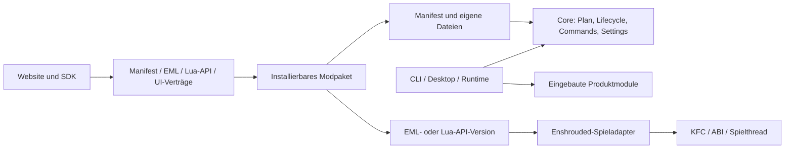

Die Baumform benennt fachliche Besitzer, keine Pflicht zu einer Datei pro Zeile. Providerordner werden nur für echte Adapterlogik angelegt; ein winziger Adapter darf eine einzelne Datei sein. Keine dauerhafte Umleitungsdatei darf einen alten Besitzer weiterleben lassen. Im Manifestordner liegt die einzige unterstützte `mod.json`-Version; EML, Lua-API und UI erhalten jeweils unabhängig ihren eigenen Versionsordner. API-Implementierung, die tatsächlich versionsgebundene Lua-Bindings bereitstellt, liegt in der betreffenden API-Familie. Generische Laufzeitmechanik, KFC-Reader und spielabhängige ABI-Implementierung bleiben bei Core bzw. Spieladapter und werden nicht künstlich in API-Ordner kopiert.

Interne Desktop-/Updater-/Runtimezustände und deren JSON-Schemas liegen bei `core/control/state`; sie sind kein Mod-API-Vertrag und gehören deshalb nicht in `platform`.

Diese Verzeichnisse sind Besitzergrenzen, **keine Forderung nach einem Cargo-Crate pro Unteraufgabe**. Crates trennen wir bei tatsächlichen Abhängigkeits-, Plattform- oder Artefaktgrenzen. Bestehende Crates werden auf die neue Besitzstruktur umgebaut; keine dauerhafte Fassade führt weiterhin auf eine zweite Altimplementierung.

Dateien heißen nach ihrer Arbeit: `github_releases.rs`, `package_store.rs`, `library.lua`. Keine zusätzliche Kette `manager → service → handler → provider` für dieselbe Aktion. Kleine zusammengehörige Funktionen bleiben zusammen. Eine Datei hat einen fachlichen Hauptgrund, sich zu ändern; verwandte Typen und kleine Hilfsfunktionen bleiben direkt daneben. Eine sehr große Datei wird an stabilen Verantwortungsgrenzen in mehrere lesbare Dateien geteilt. 500 Zeilen sind Anlass für eine kurze Begründung im Review, kein automatisches Splitziel; eine Datei mit tausenden Zeilen und mehreren Verantwortlichkeiten ist unzulässig. Eine neue Datei oder Abstraktion zählt nur, wenn sie einen eigenen Besitzer hat oder wiederholte Implementierung löscht.

Die Abhängigkeitsrichtung ist verbindlich und azyklisch: Anwendungen verdrahten Core, Produktmodule und Adapter; Core definiert allgemeine Ports und Lifecycle; Produktmodule implementieren ihre Fachfunktion über diese Ports; Spieladapter implementieren spielgebundene Ports; `platform` beschreibt die öffentliche Modautoroberfläche; Mods hängen nur vom veröffentlichten Vertrag ab. Ein Produktmodul importiert keine privaten Dateien eines anderen Produktmoduls. Gemeinsam genutzter Code wandert nur dann in Core, wenn er tatsächlich eine allgemeine Verantwortung besitzt und mindestens zwei konkrete Verbraucher ersetzt.

Jedes eingebaute Produktmodul hat einen klaren Contract, Handler und bei Bedarf eine Ansicht:

```text
src/modules/<product-feature>/
  contract.json       # Befehle, Settings und sichtbare Metadaten dieses Features
  commands.rs         # Handler und Jobablauf
  ...                 # weitere Dateien nur an echten Verantwortungsgrenzen
  ui/                 # optionale Darstellung; keine Fachausführung im UI-Callback
```

Nicht jedes Modul muss alle diese Dateien anlegen. Der Contract erzeugt nur Metadaten, Schema und Hilfe; die Ausführung bleibt normaler, lesbarer Code. Ein neues Schema-Framework, ein Generator oder ein Cargo-Crate wird nicht allein für Einheitlichkeit eingeführt.

```text
Anwendungen → Core + Module + API + Spieladapter
Produktmodule → Core-Verträge und SDK-Datentypen
API            → Core-Dienste und Spieladapter
Spieladapter   → gemeinsame Kontext-/Statusverträge, keine UI oder einzelne Mod
Core           → gemeinsame Datentypen, keine konkreten Mods oder Feature-UIs
Modpaket    → öffentliche API und eigene Paketdateien
Website     → jede Vertragsfamilie separat unter src/platform
```

Die Anwendung verdrahtet Implementierungen ausdrücklich. Diagnose beobachtet beispielsweise den Runtime-Lifecycle über den gemeinsamen Status; der Core importiert nicht die Diagnosefunktion. Spielbezogene Typen dürfen nicht über allgemeine Lua-Helfer unbemerkt in den Core zurücklaufen. Diese Grenzen müssen kompilierbar hergestellt werden.

Eine wichtige echte Buildgrenze: `src/core` bleibt ohne WebView-Abhängigkeit. Der UI-Host ist ein separates Paket unter `src/core/ui_host`, das den Core verwendet. Das Runtime-FFI-Paket unter `src/apps/game_runtime` hängt von Core, API und Spieladapter ab; das CLI-/Desktop-/Updater-Hostpaket unter `src/apps` darf zusätzlich UI-Host und eingebaute Featuremodule verwenden. Eine für die Ingame-Fläche nötige native Render-/Eingabeanbindung gehört in einen ausdrücklich eingebundenen Hostadapter. Headless-Starts laden diese nicht. Kein solcher Adapter enthält konkrete Modoberflächen. Übrige Cratezusammenlegungen werden im jeweiligen Arbeitsauftrag mit ihren Verbrauchern umgesetzt.

Zur Laufzeit gibt es ausdrücklich benannte Rollen: eine Control-Instanz je Installation, eine Runtime je Spielprozess, einen allgemeinen UI-Host bei Bedarf und den vorhandenen Installationsworker für Arbeit über das Spielende hinaus. Der Control-Host kann als Modus von `shroudforge.exe` starten und besitzt eine Installationssperre; keine zusätzliche EXE pro Mod. Paketdeklarationen bestimmen, welche Modansichten angelegt werden. UI-Start, Controllerstart und Modaktivierung sind getrennte Ereignisse. Die Prozessanbindung des Ingame-Renderers wird in A4 anhand eines lauffähigen Prototyps festgelegt; ein angeheftetes Desktopfenster wird dabei nicht als bereits integrierte Ingame-Fläche ausgegeben.

## 4. World Editor als vollständige Mod mit eigener UI

Der World Editor ist hier ein **umfangreicher Konformitätsverbraucher**, nicht das Ziel des Modloaderprodukts. Allgemeine Vertragsregeln und die erste Minimalmod müssen unabhängig vom World Editor funktionieren. Erst wenn dieselben Dienste eine kleine fremde Mod, eine Runtime-Mod und eine Mod mit eigener UI tragen, wird der Editor als anspruchsvoller Integrationsfall migriert.

### Paket und Funktionsbesitz

```text
mods/world-editor/
  mod.json                      # einziges Manifest schemaVersion 1 für die ganze Mod
  icon.svg
  src/
    mod.lua                     # Lifecycle und Registrierung
    commands.lua                # alle Aktionen, unabhängig von sichtbaren Buttons
    selection.lua               # Auswahl und Cursor
    library.lua                 # Format, Laden/Speichern, Namen, Bibliothek
    covers.lua                  # Screenshotzuordnung und Cover-Undo
    paste.lua                   # Platzierungsablauf
    undo.lua                    # fachliche Rücknahme und Konfliktprüfung
    building_plan.lua           # vorhandene Rezept-/Bauplanung
    game_building.lua           # vorhandener Spieleingabemodus
  ui/
    index.html
    app.js
    images.js                   # Bilddekodierung, Vorschau, Coverexport dieser Mod
    styles.css
  README.md
```

`mod.json` ist die einzige Paketdefinitionsdatei. Sie enthält Identität, Version, Capability, Ziele, Settings, Befehle, Views und optionale native Einstiegspunkte. Das eine Schema hat `schemaVersion: 1` und wird direkt aktualisiert. `extended.mod.json` und `native-plugin.ini` entfallen.

Die Aufteilung von `mod.lua` folgt den fachlichen Zuständen. Ein expliziter Editorzustand gehört der Modinstanz und wird den Funktionen übergeben. Capture-/Paste-/Undo-Zustand wird nicht als verstreute globale Variablen auf Dateien verteilt.

| Heute | Ziel |
|---|---|
| `world-editor-ui/ui/index.html`, `styles.css` | Modpaket; JavaScript aus HTML/Rust in eine `ui/app.js` vereinigen |
| `view_state` und `editor-state.txt`-Parser | Mod veröffentlicht strukturierten Zustand. Host interpretiert keine Blueprintdateien oder Editor-Textschlüssel. |
| `apply_screenshot`, `backup_cover`, `undo_screenshot` | Fachablauf nach `src/covers.lua`; Bildverarbeitung in Mod-Lua/`ui/images.js` oder einer Modbibliothek. Formatunterstützung und Ausgabeverhalten bleiben Abnahmekriterien. |
| Blueprintnamen, Bibliothekspfade, Steam-Screenshot-Suche und Zuordnung | Modbibliothek und Mod-UI; Zugriff über dokumentierte allgemeine Datei-/Datenrechte. Der Host erhält keine Screenshot- oder Spielmedien-API für den Editor. |
| Fensterposition, WebView, Hotkeys/Fokus, Stop-Ereignis | `core/ui_host`, parametrisiert durch Ansicht und Settings |
| `dispatch_action`, spezielle DOM-Events, Tab-getrennte Payloads | Gemeinsamer Bridgeclient mit strukturierten Parametern und Ergebnis-ID |
| Bootstrap-Editorstart, Cargo-Abhängigkeit, eingebettetes Modicon | Entfallen nach Migration zum generischen Host |
| `modules.worldEditor`, `worldEditorSettings`, feste Window-Schemafelder | Modsettings und `modId + viewId`; altes Feld entfernen, nur neuer Configzustand wird gelesen |

### Das allgemeine Ingame-UI-Angebot des Loaders

Der Loader liefert einen gemeinsamen Rahmen: Ansichten registrieren und öffnen, Panel/Tab platzieren, Größe und Sichtbarkeit halten, Eingabefokus zwischen Spiel und UI übergeben, Theme und Skalierung anwenden. Die allgemeine Ingame-Modansicht zeigt die für den aktuellen Prozess geeigneten aktiven Mods und deren deklarierte Views; sie braucht keine manuelle Loaderliste. Das SDK liefert allgemeine Controls wie Buttons, Felder, Listen und Tabs sowie eine startbare Mod-UI-Vorlage. Mods können diese Controls verwenden oder eigene Inhalte innerhalb ihrer Fläche darstellen. Ein deklaratives Standardformular für Settings/Befehle und eine selbst gestaltete Modoberfläche verwenden dieselbe Bridge.

**Vorlage und Host haben getrennte Aufgaben:** `src/platform/sdk/templates/mod-with-ui` erzeugt bearbeitbaren Code im Modpaket. `src/platform/ui/v1` stellt allgemeine v1-Komponenten und den öffentlichen Viewvertrag bereit. `core/ui_host` betreibt den gemeinsamen Rahmen und die Kommunikationsverbindung. Keiner dieser drei Bereiche enthält Blueprintkarten, Screenshotauswahl, Editor-Undo oder andere Modfachfunktionen.

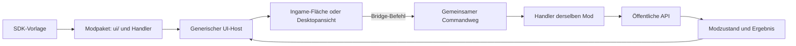

Der UI-Vertrag v1 beschreibt Ansichten und Nachrichten unabhängig vom Renderer. Vorgesehene Flächen sind `ingame-panel` für die gemeinsame Ingame-UI und `desktop-window` für ein optionales eigenes Fenster. Das bestehende Editorfenster bleibt bis zur Umstellung des Editors nutzbar. Eine echte Ingame-Fläche ist ein eigener Implementierungsauftrag mit Eingabe-/Fokus-/Rendernachweis; das heutige externe WebView-Fenster beweist diese Fähigkeit noch nicht.

### Der fehlende allgemeine Vertrag

Dafür muss ein **neuer dokumentierter Mod-UI-Vertrag implementiert** werden. Zum Funktionsumfang gehören:

1. Paketrelative UI-Einstiege/Ressourcen in Verzeichnis und ZIP, gemeinsame UI-Fläche und SDK-Vorlage. Der aktuelle Loader liest ausschließlich das aktive Paketformat.
2. Ansichts-Lifecycle: öffnen, schließen, Mod deaktiviert/aktualisiert, Spiel beendet. Eine entladene Mod kann nicht über ein altes Fenster weiter aufgerufen werden.
3. Gemeinsame Befehle mit Parametern, Ergebnis, Fortschritt, Fehler und Abbruch.
4. Modzustand mit Revision, lesbar für UI und Status-/Diagnoseabfrage.
5. Allgemeine paketbezogene Datenablage und ausdrücklich freigegebener Dateizugriff. Die Mod liest/verarbeitet ihre Formate und Bilder selbst. Benötigte Bibliotheken liefert sie mit; `image`/`resvg` werden nicht aufgrund des Editors in eine neue Loader-Bild-API übernommen.
6. Identität vom Host: Ein Fenster erhält Mod-/Ansichtsidentität aus dem geöffneten Paket. Ein frei gesendetes `modId` ersetzt sie nicht. Paketpfade bleiben im Paketbereich; externe Dateien werden ausdrücklich ausgewählt. Native DLLs bleiben nativer Prozesscode und sind keine vollständig sandboxed Lua-Funktion.
7. Einheitliche Hotkeyregistrierung mit Konflikt-/Fokusbehandlung. F2–F8 des Editors bleiben als Bedienfunktionen erhalten.

**Ein Manifest, ein aktuelles Schema:** Das existierende `mod.json`-Schema v1 wird direkt erweitert. Es enthält die Modidentität und Fähigkeiten, Laufzeiteinstieg, Ziele, Settings, Befehle und Ansichten. Die EML-Fähigkeiten bleiben Fähigkeiten; eine View ist ein normaler Manifestabschnitt, keine neue EML-Fähigkeit. `extended.mod.json`, ein Schema v2, zwei Parser und Versionsadapter entfallen. Der Loader akzeptiert nur dieses eine Schema v1.

```json
{
  "schemaVersion": 1,
  "id": "meine-mod",
  "name": "Meine Mod",
  "version": "1.0.0",
  "capabilities": ["runtime"],
  "targets": ["client"],
  "entrypoints": { "runtime": "src/mod.lua" },
  "settings": {},
  "views": {
    "main": { "entry": "ui/index.html", "surface": "ingame-panel", "hotkey": "F2" }
  },
  "commands": {
    "selectBlueprint": {
      "execution": "mod-runtime",
      "input": {
        "type": "object",
        "required": ["name"],
        "properties": { "name": { "type": "string" } },
        "additionalProperties": false
      }
    }
  }
}
```

Dieses verkürzte Beispiel zeigt den Besitz. Das vollständige Schema ergänzt Standardaktivierung, Settings, Ausgabe-/Fehlerschema und Fähigkeiten. Ein Befehl ist unabhängig davon deklariert, ob das allgemeine Modloaderformular einen Button dafür zeigt. Die bestehende öffentliche `shroudforge.ui.on_action`-Funktion wird direkt auf denselben Dispatcher umgestellt; dafür entsteht kein Adapter.

### Beispiel: Ein Community-Autor ergänzt eine UI

1. SDK-Vorlage in `mods/meine-mod` anlegen; Manifest benennt Runtimeeinstieg, Ansicht und Befehle.
2. In `ui/app.js` eigene Controls und Darstellung schreiben. Der Host lädt diese Dateien aus dem Paket und stellt eine bereits an diese Mod gebundene Bridge bereit.
3. Ein Klick sendet beispielsweise `bridge.invoke("selectBlueprint", { name })`. Dieser Name gehört der Mod. Der generische Host prüft Identität, Vertrag und Laufzeitkontext und leitet an ihren registrierten Handler weiter.
4. Der Modhandler führt die Fachfunktion mit der öffentlichen Spiel-/Datei-API aus und liefert Ergebnis/Zustand zurück. Die UI aktualisiert ihre Darstellung. Eine mögliche API-Form ist `bridge.state.subscribe(render)`; die endgültigen Namen werden mit A3 implementiert und dokumentiert.
5. Schließen einer Ansicht beendet ihr Abonnement. Deaktivieren/Entladen der Mod schließt alle ihre Ansichten und verhindert weitere Befehle an die alte Modinstanz.

Der neue Autor verändert dafür ausschließlich sein Paket. Loaderquelltext, globale Configfelder, Bootstrap und Website benötigen keinen Eintrag für seinen Modnamen. Der Website-Editor kann dieselbe Vorlage mit einem Vorschautransport anzeigen; Spielaktionen werden dort ausdrücklich als Vorschau simuliert.

**Grenzregel für neue APIs:** Eine allgemeine Fähigkeit wird anhand ihres öffentlichen Vertrags beschrieben, beispielsweise Ansicht, Befehl, Zustand, Datei oder Spielobjekt. Eine fehlende Modfachfunktion begründet keinen neuen spezialisierten Hostaufruf. Screenshotkonvertierung, Blueprintverwaltung und Coverexport werden vollständig im Modpaket implementiert. Eine mitgelieferte native Erweiterung folgt dem allgemeinen Erweiterungsvertrag; sie ist ebenfalls Teil der Mod.

Das aktuelle Blueprintformat und die zugehörigen Dateien bleiben Nutzdaten der Mod. Der Umbau führt keinen Parser für frühere Manifest-, Config- oder Editorzustandsvarianten ein. Die Installation startet mit den Defaults des neuen Vertrags; bisherige Settings werden neu gesetzt. Screenshotfunktion, Speicherschritte, Bibliothek, Auswahl, Rotation, beide Platzierungsmodi und Undo gehören zur Funktionsabnahme.

**Architekturbeweis:** Das aktualisierte World-Editor-ZIP auf einem unveränderten generischen Loader installieren. Eine zweite Mod nach demselben aktuellen Manifest v1 muss ohne Bootstrap-, Cargo- oder globale Configänderung funktionieren. Ohne installiertes Editorpaket gibt es keine Editoroberfläche im Host. Konkrete Modnamen dürfen dort nur in Modpaket und Tests vorkommen.

## 5. UI, CLI und Dedicated Server: ein Befehl, eine Implementierung

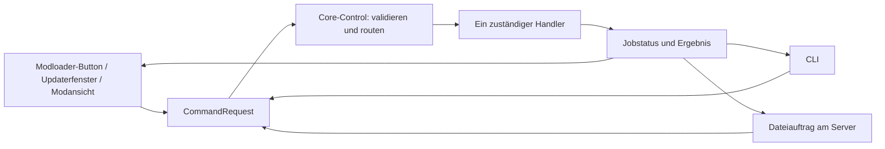

`core/control` besitzt Annahme, Zuordnung und Ergebnisse. Das Fachmodul besitzt die Ausführung. Der gemeinsame Vertrag enthält: stabile ID, Besitzer, Eingabe-/Ausgabeschema, Ausführungsort, Voraussetzungen an Prozess/Spielzustand, Berechtigung, Abbruch und Wiederholungsverhalten. Die Registrierung verbindet ihn mit genau einem Handler. Derselbe Datensatz speist CLI-Hilfe, UI-Aktionen, Dateivorlagen und Dokumentation.

Geplante CLI, heute noch nicht vorhanden:

```text
shroudforge commands list --root <installation>
shroudforge commands describe updater.check --root <installation>
shroudforge command updater.check --root <installation> --args-file request-args.json
shroudforge command mod.world-editor.selectBlueprint --instance <id> --args-file selection.json
```

Bei reinem Dateizugriff wird derselbe Auftrag atomar abgelegt:

```json
{
  "requestId": "admin-20261009-001",
  "command": "updater.check",
  "target": { "installation": "server-installation" },
  "arguments": {}
}
```

Die Umsetzung muss folgende Punkte lösen:

- Ein Controller pro Installation besitzt die Annahme. Sperre und Besitzerkennung verhindern konkurrierende UI-/Headless-Controller. Der allgemeine Host startet ihn; kein Fenster oder Updater besitzt die übrige Administration.
- Offlineaktionen laufen ohne Spiel und WebView. Runtimebefehle gehören zu einer aktiven Spielinstanz. Bei mehreren passenden Instanzen muss das Ziel angegeben werden.
- Instanzidentität enthält Prozessziel, PID und Startkennung. Ergebnisse einer alten Sitzung dürfen nicht in eine neue geraten.
- Lua läuft im vorgesehenen Lifecycle; native Weltoperationen bleiben auf dem Spielthread. Ein Dateipoller ruft keine Spieloperation direkt auf.
- Annahme, Ausführung und fachlicher Abschluss sind eigene Zustände. Workerübergabe ist noch keine erfolgreiche Installation.
- Request-IDs verhindern doppelte Annahme. Bei einem Absturz garantieren sie allein keine genau einmal erfolgte Nebenwirkung. Handler stellen anhand ihres Journals wieder her oder melden einen unklaren Ausgang; nicht idempotente Spielaktionen werden nicht automatisch erneut gesendet.
- Alte `control.actions.<name> = true` Felder werden entfernt. Die neue Installation verwendet nur den Befehlskatalog; es gibt keinen Boolesch-zu-Befehl-Adapter.
- Alle bisherigen 20 Aktionen erhalten einen gemeinsamen Handler. UI-/CLI-/Dateizugriff verwenden dieselben Regeln für Aktionen, die auf dem Ziel tatsächlich möglich sind. Ein Dedicated Server bekommt dadurch keinen erfundenen lokalen Cursor oder Dateidialog.

Steam-P2P-Nachrichten einer Mod sind **kein** Admin-Command und laufen nicht über `core/control`: Der öffentliche Runtime-Transport liefert nur den Peerkanal; Modpaket definiert Empfänger, Nachrichtenschema, Berechtigung, Wiederholung und fachliche Wirkung. Serververwaltungsbefehle bleiben dagegen im gemeinsamen Command-/Jobpfad. Der Transportweg kann Client-zu-Server-Nachrichten senden; Antworten sind wiederum Modnachrichten und brauchen dieselbe explizite Absender-/Sitzungsprüfung. `send` bestätigt die Annahme durch Steam, nicht die serverseitige Ausführung.

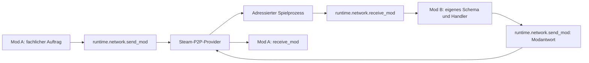

Damit entfallen getrennte Headless-, UI-Control- und Mod-Sonderlisten. Eine Aktion darf wegen ihres Zielkontexts ungeeignet sein, aber nicht wegen einer fehlenden Kopie ihres Handlers im Servercontroller.

## 6. Konfiguration: derselbe Wert und dieselbe Regel überall

„1:1“ heißt: Jeder bearbeitbare UI-Wert hat einen eindeutigen Configpfad und denselben Typ, dieselben Grenzen, denselben Standardwert und Anwendungszeitpunkt. Jeder Button hat einen eindeutigen Befehl. Jeder Statuswert kommt vom ausführenden Besitzer.

| Sache | Besitzer | Speicherung/Anzeige |
|---|---|---|
| Einstellung | Fachmodul/Mod deklariert; Core validiert und speichert Werte | Config → effektiver Wert → dasselbe Formular; CLI/Datei verwenden dieselbe Validierung |
| Aktion | Deklarierter Fachbefehl | Request mit ID und Argumenten über Button, CLI oder Datei |
| Ergebnis/Fortschritt | Ausführender Handler | Schreibgeschützter Status; keine als Einstellung getarnte aktuelle Releaseantwort |
| Fensterpräferenz | Allgemeiner UI-Host pro Ansicht | Mod-/Viewidentität; kein globales `worldEditor`-Sonderfeld |

Ein Modul hält seine Beschreibung bei sich, etwa `src/modules/system-updater/contract.json`. Daraus entstehen Defaults, der entsprechende Abschnitt des Gesamtschemas, UI-Metadaten und Hilfe. Handgeschriebene Ausführung liegt in `commands.rs`; generierte IDs verbinden Vertrag und Handler. Zusätzliche Regeln zwischen mehreren Feldern gehören zum selben fachlichen Besitzer und werden von allen Eingängen verwendet.

Die neue Config hat von Anfang an einen einzigen konsistenten Aufbau. Jeder Wert erhält seinen Pfad direkt im Besitzervertrag. Alte Dateien und Feldpfade werden beim Refactor nicht eingelesen oder parallel geschrieben; die aktualisierte Installation legt die neue Config mit aktuellen Defaults an. Es gibt keine Migrations-/Kompatibilitätsschicht.

Für Mods werden Paketdefaults und Benutzerwerte getrennt. Das Paket liefert Definitionen; ein benutzerseitiger Store hält Aktivierung/Werte. Ein Paketupdate überschreibt dadurch keine Nutzereinstellung. Das neue v1-Manifest wird direkt gelesen. Die alte `extended.mod.json` sowie das bisherige Schreiben von Nutzerwerten neben die Paketdefinition entfallen. Es gibt keine Altdatei-Erkennung und keine zweite beschreibbare Wahrheit.

Das Manifest v1 deklariert `apply = live | next-start` je Setting. Laufzeitänderungen quittieren gewünschte und angewendete Revision. Settingsanwendung wird nur aus diesem Feld ermittelt; Lua-Quelltext wird dafür nicht durchsucht. Validierungsfehler, Defaults und notwendige Neustarts stimmen zwischen UI, CLI und Status überein. Core-Speicherung enthält dafür keine Modnamen oder Listen konkreter Featurefelder.

## 7. Produktmodule, externe Provider und Diagnose sauber trennen

```text
Desktop-Ansicht / CLI / Dedicated-Server-Befehl
  → gemeinsamer Command-Dispatcher
      ├→ systemUpdater.check / systemUpdater.stage
      │    → System-Updater → provider/github-releases → System-Update-Job
      │         → Download, SHA-256, ZIP-Prüfung, Wartung, Dateiersatz und Rollback
      ├→ modCatalog.search / modCatalog.install / modCatalog.update
      │    → Modkatalog → provider/shroudedit → generischer Modpaketstore → Mod-Lifecycle
      └→ diagnostics.start / diagnostics.snapshot / diagnostics.stop / diagnostics.export
           → Diagnosejob → registrierte Loader-, Spiel- und Moddatenquellen → Diagnosepaket
```

Ein **Provider** ist ein klar benannter Adapter zu genau einem externen Ziel oder Datenlieferanten. Er übersetzt dessen Protokoll in die lokalen Typen seines Besitzermoduls. Er besitzt weder UI noch Jobsteuerung, Configspeicher oder Paketinstallation. Für zwei fachlich verschiedene Ziele gibt es keine gemeinsame `UpdaterProvider`-Abstraktion: gemeinsamer HTTP-Transport ist erlaubt, aber Endpunkte, Modelle, Fehler und Auswahlregeln bleiben beim jeweiligen Provider.

| Ziel/Quelle | Fachlicher Besitzer | Providerordner | Provider darf | Provider darf nicht |
|---|---|---|---|---|
| GitHub-Releases von ShroudForge | System-Updater | `src/modules/system-updater/providers/github-releases/` | Releaseendpunkte abrufen, GitHub-Antworten prüfen und in Releasekandidaten umwandeln | Modpakete suchen/installieren oder UI-/Queuezustände besitzen |
| ShroudEdit-Modkatalog | Modkatalog | `src/modules/mod-catalog/providers/shroudedit/` | Projekte/Versionen suchen, Metadaten und Paket-Downloadinformationen liefern | ShroudForge-Binärupdates ausführen oder Pakete selbst in den Runtimeordner entpacken |
| installierbares Modpaket | generischer Modpaketstore | `src/core/mods/package_store/` | ZIP/Verzeichnis prüfen, Grenzen durchsetzen, transaktional installieren/entfernen | Katalogsemantik oder Anbieter-API kennen |
| Windows-Dateiersatz für ShroudForge | System-Updater-Worker | `src/modules/system-updater/worker/` | auf Prozesse warten, freigegebene Programmdateien ersetzen und Rollback ausführen | Releaseauswahl, Katalogsuche oder Runtime-Lifecycle verwalten |

Die Update-Ansicht ist ein Verbraucher beider Produktbereiche: Sie kann System- und Modupdates gemeinsam anzeigen, schickt aber unterschiedliche fachliche Commands. System-Updater und Modkatalog besitzen getrennte Jobs, Zustände und Fehler. Der Runtimebesitzer führt Mod-Reload/Unload aus; der Katalogstore fordert diesen über denselben Modbefehl an.

```text
src/modules/system-updater/
  contract.json                 # Systemupdate-Commands und Settings
  commands.rs                   # check/stage/cancel an Jobs übergeben
  providers/
    github-releases/            # ausschließlich GitHub-Endpunkte und Antwortabbildung
  jobs/                         # Releaseprüfung, Download/Verifikation, Stage
  worker/                       # Prozesswechsel, Dateiersatz und Rollback

src/modules/mod-catalog/
  contract.json                 # Suche und Modpaketinstallation als Commands
  commands.rs                   # Eingaben validieren und Catalog-/Storejobs starten
  providers/
    shroudedit/                 # ausschließlich ShroudEdit-Endpunkte und Antwortabbildung
  jobs/                         # Suche und Projekt-/Versionsauswahl

src/modules/diagnostics/
  contract.json                 # Diagnose-Commands, auswählbare Bereiche und Export
  commands.rs                   # start/snapshot/stop/export als Diagnosejobs
  jobs/                         # begrenzte Sammlung, Redaktion und Berichtsbau
  providers/                    # Loaderstatus, Runtime/Gameadapter und opt-in Modbeiträge
  schemas/                      # Laufstatus und exportiertes Berichtformat

src/core/mods/package_store/    # generische Paketprüfung und Installation
src/core/runtime/mod_commands.rs # unload/reload durch den Runtimebesitzer
```

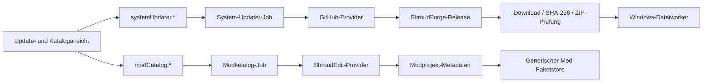

`UpdaterPanel` und `CatalogView` können in derselben ShroudForge-Desktopanwendung liegen; deren Eventhandler enthalten keine Anfrage-, Release-, Download- oder Installationslogik. Das kompakte Updatefenster verwendet dieselbe Darstellung. `shroudforge-updater.exe` ist der Windows-Prozess für Dateioperationen, die das Schließen des Spiels erfordern; er hat keinen eigenen fachlichen Updatepfad. Der Dedicated Server kann dieselben Installations-Commands abgeben und Status abfragen, lädt dafür aber keine WebView.

### Konkreter Ablauf: GitHub-Systemupdate im Desktop, per CLI und auf Dedicated Server

| Schritt | Desktopklick | CLI / Dedicated Server | Besitzer und Ergebnis |
|---|---|---|---|
| 1. Version prüfen | `UpdaterPanel` sendet `systemUpdater.check` | CLI/Control sendet denselben Befehl | System-Updater fragt GitHub einmal ab, prüft Releaseformat und speichert typisierten Releasezustand. |
| 2. Einreihen | `systemUpdater.queue` | derselbe Befehl | System-Updater erzeugt dieselbe Job-ID/Queueposition; UI implementiert keine Releaseauswahl. |
| 3. Starten | `systemUpdater.start({waitForGame})` | derselbe Befehl mit identischen Parametern | Dispatcher routet zum System-Updater. Er führt keine zweite Status- oder Downloadlogik aus. |
| 4. Download und Prüfen | UI zeigt Jobstatus und Fortschritt | Headlessstatus zeigt dieselbe Job-ID, denselben Schritt und Fehler | Updaterjob lädt, prüft SHA-256 und ZIP-Inhalt und meldet `verified` oder einen begründeten Fehler. |
| 5. Spiel schließen / Dateien ersetzen | Worker wartet auf das Zielspiel | derselbe Worker, falls das Spiel läuft | Nur der Worker besitzt Windows-Prozessprüfung, Prozesswechsel, Installation und Rollback; der Worker darf seine eigene laufende EXE nicht ersetzen. |
| 6. Abschluss | `UpdaterPanel` liest Ergebnis | CLI/Server erhält denselben Abschlussstatus; keine WebView wird gestartet | System-Updater publiziert `installed`, `cancelled` oder `error` am Job. |

**Änderungseinstiege:** GitHub-URL, Repository oder Releaseantwort → `system-updater/providers/github-releases/`; Auswahlregel oder Signaturprüfung → Systemupdatejob; ShroudEdit-Endpunkt oder Katalogantwort → `mod-catalog/providers/shroudedit/`; ZIPgrenzen und atomare Installation → `core/mods/package_store/`; Darstellung und Filter → jeweilige Desktopansicht; Windows-Dateiersatz → `system-updater/worker/`. Alle Eingänge verwenden die jeweiligen gleichen Jobs.

### Konkreter Ablauf: Mod aus dem Katalog installieren

`CatalogView` sendet `modCatalog.install(projectId)`. Der ShroudEdit-Provider löst Download-URL und erwartete Metadaten auf. Der generische Modpaketstore lädt und prüft das Modpaket, wendet die Pakettransaktion an und erzeugt den Modstatus. Wenn der Runtimezustand es erlaubt, wird der Runtime-Lifecycle angesprochen. Katalog und Serverauftrag fragen denselben Paket-/Modstatus ab. Der System-Updater ersetzt keine Moddateien und enthält keine Modinstallations- oder Reloadhandler.

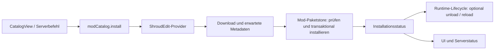


### Diagnose: ein auswählbarer, exportierbarer Jobdienst

Die Runtime-Diagnose ist eine eingebaute ShroudForge-Funktion. Ihre Aufgaben werden nicht in Modloader-UI, Runtimeprovider und Entwicklerwerkzeuge aufgeteilt. `diagnostics.start`, `snapshot`, `stop` und `export` laufen durch denselben Command-/Jobpfad, egal ob ein Nutzer sie in der Modloader-UI auswählt, per CLI startet, ShroudForge intern anfordert oder ein ausdrücklich berechtigter Modbefehl einen begrenzten Diagnosejob anfordert. Der Diagnosebesitzer prüft Capability und erlaubte Bereiche; ein Mod erhält keinen direkten Zugang zu fremden Diagnosequellen oder Exportdateien. Die UI zeigt auswählbare Diagnosebereiche, Laufzeit, letzte Probe und vorhandene Berichte; Export und Dateischreiben bleiben beim Diagnosemodul.

Diagnosedaten kommen über registrierte Provider: ShroudForge/Core, Spielruntime und ausdrücklich opt-in bereitgestellte Modabschnitte. Ein Mod kann nur seinen eigenen benannten Abschnitt liefern und weder fremde Moddateien noch beliebige Speicherbereiche auslesen. Ein Lauf hat Zeit-/Größenlimits, begrenzte Bereiche, Fehler pro Provider, feste Redaktionsregeln und eine stabile Berichtversion. Der Berichtexport benennt enthaltene Bereiche und ersetzt Geheimnisse/persönliche Pfade gemäß Redaktion; UI und Provider überschreiben diese Regeln nicht.

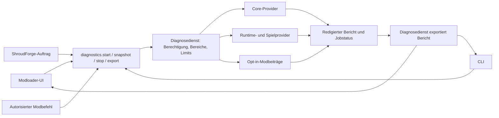

Runtime-Messungen und ihr natives Snapshotinterface gehören zum Diagnosemodul als Providerbeitrag; Diagnoseeinstellungen, Statusschema und Export gehören nicht in `package/config.rs` oder UI-spezifische Schlüssel. Die heutige `modules/runtime-diagnostics`-Crate, `--runtime-diagnostics`-CLI, `diagnostics-status`-Sondervalidierung und die React-Verzweigung werden zu diesem einen Dienst und seinem generischen Commandvertrag zusammengeführt. Profilfreigabe, Live-ECS-Capture, PE-Inspektion und Hookbelege bleiben Maintainerwerkzeuge unter `tools/enshrouded/`; sie werden nicht als Nutzerdiagnose exportiert.

## 8. Laden, Phasen, Prozessziele und Multiplayer

### Genau ein Ladeplan

1. Anwendung legt Installation und Prozessrolle fest. Client/Server werden nicht an mehreren Stellen mit unterschiedlicher EXE-Priorität erraten.
2. Core entdeckt Verzeichnis-/ZIP-Pakete und liest genau ein `mod.json`-Schema v1 direkt in das Modmodell. Revisionen erlauben Caching; Statuspolling durchsucht nicht erneut sämtliche Lua-Dateien.
3. Planer prüft Aktivierung, Ziel, Version, Abhängigkeiten und Konflikte. Ergebnis: Plan mit Gründen je Paket und getrennten Aufgaben für Assetphase, Runtime und Ansichten.
4. Assetphase läuft im vorgesehenen Startupfenster mit Backup/Lock/Transaktion. Runtime-Mods mit zusätzlichem `export` werden dadurch nicht zu Assetmods.
5. Native Runtime wird für den tatsächlichen Gamebuild eingerichtet. Core erzeugt Lua-Umgebungen; API wird registriert; die vorgesehenen Mod-Lifecycle-Einstiege laufen.
6. UI-Host erhält die Ansichten aktiver, geeigneter Pakete. Der Dedicated Server lädt keine WebView wegen einer installierten Mod.
7. Deaktivieren/Update/Beenden folgt demselben Mod-Lifecycle: Befehle stoppen, Ansichten schließen, Arbeit abschließen/abbrechen, Ressourcen freigeben. Native DLLs behalten ihre tatsächlichen Unload-/Neustartgrenzen.

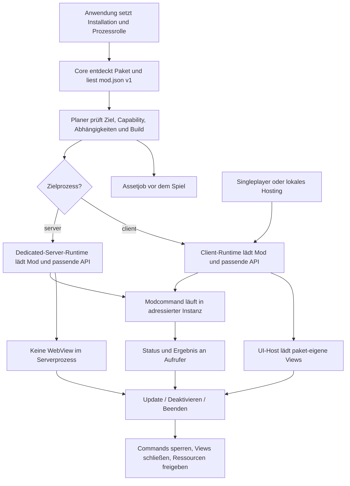

| Begriff | Aussage | Daraus nicht ableitbar |
|---|---|---|
| Prozessziel `client` / `server` | EXE und Modziel | Netzwerkautorität oder automatische Übertragung |
| Phase `pregame` / `ingame` | Vorgesehene Lebensphase und Zugriffsarten | Eine konkrete Welt ist schon verfügbar |
| Capability | Was die Mod deklariert und verwenden darf | Profil/Provider/Operation sind gerade bereit |
| Buildunterstützung | Operation für diese EXE geprüft | Aktueller Cursor oder benötigtes Spielobjekt existiert |
| Welt-/Netzwerkkontext | Beobachteter Kontext, gegebenenfalls `unknown` | Singleplayer/Host allein aus `is_client` |
| Ausführungsbestätigung | Ein definierter Schritt wurde ausgeführt | Serverannahme, Replikation und Spielstandspeicherung ohne entsprechenden Nachweis |

Singleplayer und lokales Hosting bleiben Clientprozesse. Ein beigetretener Client hat denselben Prozessnamen. Der Editor-Spieleingabepfad bleibt eine normale Engineeingabe mit eigenen Annahme-/Beobachtungsgrenzen; er ist keine neue allgemeine Mod-RPC-Verbindung. Direkte Weltänderung und Spieleingabe bleiben verschiedene Operationen.

### Capabilities und tatsächliche Verfügbarkeit

Heute verteilen sich Prüfungen über Manifest, Runner, `available`, `operation_status`, `runtime_denial_reason`, GameContract und native Readiness. Künftig besitzt jede Stelle einen klaren Fakt:

- Paketmodell: deklarierte Fähigkeiten und Prozessziele.
- Planer: für diese Instanz vorgesehen oder mit stabilem Fehlercode ausgeschlossen.
- Gemeinsame Aufrufprüfung: deklarierte Fähigkeit, aktive Mod, Phase, Prozess-/Weltkontext.
- Spieladapter: Buildunterstützung, aktueller Provider, benötigte Objekte und Spielthreadausführung.

Ein strukturiertes Ergebnis nennt Unterstützung, Berechtigung, Bereitschaft und Grund. `has`, Aufrufprüfung, UI und CLI verwenden daraus ihre zugesicherten Aussagen. Der vollständige aktuelle Lua-Vertrag definiert diese Rückgaben direkt in `src/platform/api/lua/v1` oder `src/platform/api/eml/v1`, je nachdem welcher Vertrag die Operation veröffentlicht; es gibt keine zusätzlichen Wrapper für frühere Rückgabeformen. Nativer Zustand wird bei der Ausführung erneut geprüft; ein zuvor aktivierter Button ersetzt das nicht.

## 9. API, KFC, Website, Editor und Dokumentation

`src/platform/api/lua/v1` enthält die vollständigen ShroudForge-Lua-API-v1-Bindings, Definitionen, Tests, Beispiele und Referenz. `src/platform/api/eml/v1` enthält unabhängig davon EML-v1-Bindings, Definitionen, Tests, Beispiele und Referenz. Jede Familie hat ihren vollständigen eigenen Vertrag; sie versionieren sich unabhängig. Der Modmanifestvertrag v1 und der UI-Vertrag v1 liegen ebenfalls in ihren eigenen Familien. Versionsgebundene öffentliche Bindings liegen dort; gemeinsame Lua-runtime-Helfer, KFC-Dateizugriff, Reflection, Layouts und ABI-Aufrufe bleiben bei ihren technischen Besitzern. Core besitzt den Lebenszyklus der Modinstanz.

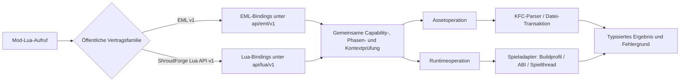

Die direkte KFC-Verwendung in heutigen API-Werten wird tatsächlich herausgelöst: versionsgebundene öffentliche Konvertierungen gehören in die jeweilige API-Familie; KFC-Parser und spielbuildgebundene Konvertierungen gehören in den Spieladapter. Generische Lua-VM, Paketplan und UI-Host hängen nicht von KFC-Implementationstypen ab. Native Symbollader aus `loader.rs`, `runtime_building.rs` und weiteren Bindings werden im Spieladapter vereinigt. C-ABI und Profilprüfung bleiben erhalten.

EML v1 und ShroudForge-Lua-API v1 sind zwei öffentliche Verträge mit getrennten Ordnern und unabhängigen Versionsentscheidungen. Native DLLs bleiben als Modfunktion erhalten; ihr Paketpfad wird im einzigen unterstützten `mod.json` v1 deklariert. `native-plugin.ini`, weitere Manifestformate und nicht unterstützte API-Versionen werden nicht eingelesen.

| Heute getrennt | Ziel |
|---|---|
| Loader-Schema und manuelle Website-Feldlisten | `src/platform/manifest/v1`; Loader und Browser validieren dasselbe Manifest v1 |
| Modloadercontrols und Website-Mockup | `src/platform/ui/v1`; Vorschau und Laufzeitansicht verwenden denselben UI-Vertrag |
| CLI-Vorlage, Website-ZIP und `templates/mod` | `src/platform/sdk/templates/`; ein aktuelles Starterpaket |
| Website-Aliastabelle und Lua-Registrierung | Tatsächlich registrierter Name und dieselbe Referenz; keine Aliasübersetzung |
| Einige erwartete Symbole in `validate.mjs` | Vollständiger Abgleich registrierter öffentlicher Symbole mit Referenz und ausführbaren Beispielen |
| API-Liste und verstreute Anleitung | Pro Operation Voraussetzungen, Parameter, Ergebnis, Fehler, Beispiel und Grenzen |
| ShroudForge-Lua-API-Funktionen | `src/platform/api/lua/v1/`; Spielprofile bleiben je Gamebuild getrennt |
| EML-Bindings und Methoden | `src/platform/api/eml/v1/` |
| Manifest- oder UI-Vertrag | `src/platform/manifest/v1/` bzw. `src/platform/ui/v1/` |

Verträge erzeugen Typen, Standardformulare, Hilfe und Referenztabellen. Fachlogik wird nicht durch ein neues universelles Schemasystem ersetzt. Beispiele und Anleitungen werden beim Besitzer gepflegt und gegen echte Aufrufe geprüft.

Der gemeinsame Beispielbestand enthält: vollständiges Basispaket, Assetmod, Runtimemod, Mod mit eigener UI, parametrisierte Aktion und native EML-Erweiterung. Jedes Beispiel erklärt Dateien, Ladezeitpunkt, Client-/Server-Eignung, Voraussetzungen, erwartetes Ergebnis und Fehlerdiagnose. World Editor ist ein umfangreicher Verbraucher; eine kleine UI-Beispielmod bleibt zusätzlich nötig.

Der Website-Editor bearbeitet sämtliche Felder des einzigen Vertrags v1 einschließlich Prozesszielen, Settings, Aktionen, Ansichten und nativen Paketdateien. Formular und JSON bearbeiten dieselbe Manifestdatei. Es gibt keinen verlustlosen Durchschleusungspfad für parallele/alte Schemas.

## 10. Datei- und Funktionszuordnung

Das CSV bildet jede erfasste Datei ab. `split` bezeichnet einen tatsächlichen Import-/Aufrufumbau. Öffentliche Verträge werden auf ihre getrennten Familienziele abgebildet: Manifest v1, EML v1, Lua-API v1 und UI v1. Die folgenden Aufträge präzisieren die großen Dateien. Quellen unter `src/loader/` sind bei `workflow/`, `package/`, `api/`, `parser/`, `compatibility/`, `runtime/` und `modules/` relativ zu diesem alten Stamm abgekürzt. Zielkurzformen `apps/core/api/modules/games` liegen unter `src/`.

| Quelle heute | Ziel | Aufgabe |
|---|---|---|
| `workflow/main.rs` | `apps/cli.rs`, `desktop.rs`, `compose.rs` | Argumente und Verdrahtung, keine Featurefachlogik |
| `workflow/lib.rs` | `apps/game_runtime/lib.rs`, `core/runtime/lifecycle.rs` | FFI und Modsession |
| `workflow/pregame.rs` | `games/enshrouded/assets/prepare.rs`, `recovery.rs` | Assetablauf mit explizitem Paketplan |
| `package/env.rs`, `registry/mod.rs`, `registry/fs.rs` | `core/mods/{discover,plan,registry,files}.rs` | Ein Paket-/Planmodell für alle Verbraucher |
| `package/registry/manifest_reader.rs` | `core/mods/manifest.rs` | Ein Parser für genau das aktive Manifest v1; keine Modcodeheuristik |
| `package/config.rs` | `core/settings/store.rs`, `core/storage/json.rs`, `core/control/config.rs`, `core/ui_host/state.rs` | Werte, atomisches Schreiben, aktuelle Befehlsconfig, allgemeine Fensterzustände |
| `package/status.rs` | `core/mods/status.rs`, `apps/desktop/snapshot.rs` | Fachstatus einmal ermitteln und für Darstellung zusammenstellen |
| `api/lib.rs` und API-Tests | `src/platform/api/lua/v1/` und `src/platform/api/eml/v1/` | öffentliche Familien getrennt führen; generische Runtimemechanik und Spieladaptercode separat zuordnen |
| `runner/*` | `core/runtime/session.rs`, `core/runtime/runner/*` | Runtime-Lifecycle ohne versionsgebundene API-Logik |
| `api/env/app_state.rs` | `core/runtime/context.rs`, `native_plugins.rs`, `games/enshrouded/assets/context.rs` | Mod-/DLL-Lifetime und KFC-Zustand |
| `api/env/loader.rs`, `api/shroudforge/v1/*`, `api/eml/v1/*`, Env-Bindings und API-Hilfsfunktionen | `src/platform/api/lua/v1/`, `src/platform/api/eml/v1/`, `core/runtime/`, `games/enshrouded/` | jede öffentliche Bindingfamilie bleibt in ihrer Version; generische und spielgebundene Mechanik bleibt beim technischen Besitzer |
| `api/env/runtime_networking.rs`, `modules/steam-networking`, `runtime/native/provider/steam_network.cpp` | `src/platform/api/lua/v1/runtime/networking.rs`, `src/modules/steam-networking`, `src/games/enshrouded/runtime/native/provider/steam_network.cpp` | Ein öffentlicher Runtimevertrag; Capability/Status aus gemeinsamer Prozessrolle; native Steam-Interfaceauflösung nur im Spielprovider |
| `api/runtime_resolution/*` | `games/enshrouded/runtime/resolution/*` | Spieltypen und Funktionsauflösung |
| `parser/src/*`, API-KFC-Ladecode, `package/backups.rs` | `games/enshrouded/assets/` | KFC, Transaktion, Backup, Export |
| `compatibility/src/lib.rs` | `games/enshrouded/compatibility.rs` | Buildunterstützung; Modkonflikte bleiben getrennt im Core |
| `runtime/native/*`, `profiles/*` | `games/enshrouded/runtime/native/*`, `profiles/*` | Zusammenhängende native Verantwortungen |
| Modloader-UI-Backend | `apps/desktop`, `core/{control,settings,mods,ui_host}`, `modules/system-updater`, `modules/mod-catalog` | Fachhandler aus der Fensterereignisschleife herauslösen |
| Modloader-`main.tsx` | Desktopnavigation, Featurepanels, `src/platform/ui/v1` | Darstellungen beim Besitzer; gemeinsame Controls/Vorschau |
| Updater-`main.rs` | Abschnitt 7 und allgemeiner Controller in `core/control` | Systemrelease, Kataloganbieter, Paketstore und Runtimeaktion bei ihren Besitzern |
| Editor-UI-Crate und Editor-Mod | Abschnitt 4 plus allgemeine Hostdienste | Vollständig installierbare Mod |
| bestehende Modifizierer und Enshrouded-Profile | Abschnitt 8; öffentliche API plus `games/enshrouded/profiles` | Profil besitzt Buildbeweis, Mod besitzt semantische Nutzung und Bedienung |
| `modules/commands` | `core/control`, CLI | Statusplatzhalter ablösen |
| Debug Console und Diagnose | `modules/logs`, `modules/diagnostics` | Fachzustand und Ansicht zusammen; Fenstertechnik gemeinsam |
| `website/app.js` | `website/{editor,reference,navigation}.js`, `src/platform/sdk`, `src/platform/api/{eml/v1,lua/v1}`, `src/platform/manifest/v1`, `src/platform/ui/v1` | Autorenwerkzeug, Referenz, Navigation; Doppelregeln entfernen |
| `build.ps1`, API-/Websitegeneratoren | stabiler Root-Einstieg, `tools/build`, `tools/sdk` | Explizite Artefakte und gemeinsamer Vertragsbuild |
| Profiletools/Untersuchungen | `tools/enshrouded/` | Maintainercode außerhalb der ausgelieferten Runtime |
| Kleine eigene Mods und EML-Pakete | bleiben je ein vollständiges Paket | Keine künstliche Zerlegung kleiner zusammenhängender Mods |

Rust-Integrationstests bleiben als solche im Cargo-Testharness registriert. Build-, Include-, Fixture- und Websitepfade sind Teil jedes Umzugs. Die C++-Game-Unterbereiche sind bereits nach ECS/World/Patch/Dispatcher aufgeteilt; ihre Implementierungen werden fachlich geprüft, aber nicht allein wegen Zeilenzahlen in neue Schichten zerlegt.

KFC- und JSON-Submodule werden als gepinnte Abhängigkeiten behandelt. KFC-Crate und Proxybuild sollen denselben Checkout konsumieren; bisher existieren Git-Cargo-Abhängigkeit und Submoduleinstieg für unterschiedliche Verbraucher. Die Vereinheitlichung erhält den Commit und aktualisiert Workspaceausschlüsse und Lockdatei. Fremdcode wird nicht als eigener Altcode gelöscht.

## 11. Arbeitsaufträge mit Ergebnis und Löschung

Den vollständigen Vertrag jeder betroffenen Familie festlegen, alle direkten Verbraucher darauf umstellen und die überholten Dateien/Wege im selben Auftrag löschen. Die Stufen liefern jeweils einen baubaren Stand ohne parallele Altpfade. Die Arbeitsreihenfolge ist verbindlich: A0 → A3 (Manifest v1) → A6 (Settings) → A7 (Ladeplan/Lifecycle) → A1 (Commands/Jobs) → A8 (EML v1, Lua-API v1 und Spieladapter getrennt) → A4 (UI v1 und Host) → A2 (Updater/Katalog/Diagnose) → A5 (World Editor als Konformitätsfall) → A9 (Website/SDK-Doku) → A10 → A11. Ein Schritt beginnt erst, wenn seine genannten Eingangsverträge implementiert und dokumentiert sind; parallele Altpfade werden im selben Schritt gelöscht.

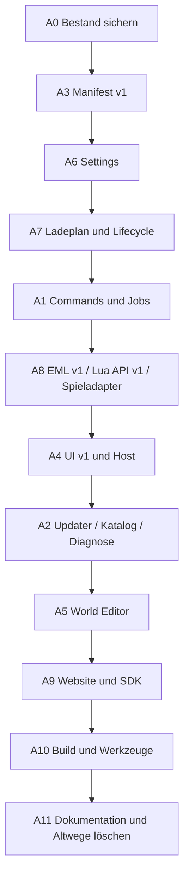

Jeder konkrete Änderungsauftrag wird gleich aufgebaut, damit ein Beitragender vor dem Öffnen beliebiger Dateien weiß, wo er arbeitet:

```text
Ziel / sichtbares Verhalten:
Fachlicher Besitzer:
Einstieg und zu ändernde Dateien:
Gemeinsame Verbraucher (UI / CLI / Server / Modpaket / Website):
Aktive Vertragsfelder und Lifecyclephase:
Altpfade oder Duplikate, die in diesem Auftrag gelöscht werden:
Erhaltene Funktionen und klare Abnahmebeispiele:
Prüfbelege / verbleibende Unsicherheiten:
```

Eine Aufgabe darf mehrere Dateien umfassen, wenn sie denselben Besitzer betreffen. Sie darf keine zweite Implementierung, Wrapperlage oder nur verschobene Kopie als Zwischenergebnis stehen lassen. Ein Querschnittsauftrag benennt seine Teilbesitzer und eine gemeinsame Abnahme.

### A0 — Bestand und Funktionen sichern

Inventar, aktuellen Diff, vorhandene Tests und sichtbare Funktionsabläufe als reproduzierbaren Quellstand einschließlich offener Änderungen festhalten. Verhalten vor dem Bruch dokumentieren; keine Adapter oder Datenmigration für frühere Formate planen. Die neue Config startet mit Defaults. Keine aktive Installation für Strukturarbeiten verwenden.

**Abnahme:** Alle vorhandenen Änderungen enthalten; vorherige Testfehler und fehlende Spielnachweise ausdrücklich dokumentiert.

### A1 — Gemeinsame Befehle ausführen

Beide `claim_*control_actions`, UI-Handler, `dispatch_ui_actions` und Commands-Platzhalter durch den einen Controlpfad, CLI und Befehlsvertrag ersetzen. Zuerst harmlose Abfrage und Modaktion vollständig von UI/CLI/Datei bis zum selben Ergebnis; danach alle 20 benötigten Aktionen neu registrieren.

**Entfällt:** Zweiter Controller, UI-Aktionsnamensliste, Headless-`SUPPORTED`-Sonderliste und alter Boolean-Configpfad.

**Abnahme:** Gleiche Aktion ohne geöffnete UI; eindeutige Runtimeinstanz; UI-Neustart verwirft keine fremde Arbeit.

### A2 — System-Updater, Modkatalog und Diagnose als Dienste ordnen

Beide Releaseclients, ShroudEdit-Anfragen, Katalog-/Paketinstallation, Diagnose-Sonderpfade und Queue/Worker nach Abschnitt 7 ihren Besitzern zuordnen. GitHub-Release und ShroudEdit bleiben getrennte Providerordner. Alle Eingänge verwenden die jeweilige gemeinsame Command-/Jobdefinition. Modpaketstore und Systemupdateworker bleiben getrennt. Die neue Installation verwendet den neuen Jobzustand; alte Controllerfelder und Workerformate werden nicht parallel eingelesen.

**Entfällt:** UI-GitHub-Client, UI-Kataloginstaller, ShroudEdit-Sonderzweig im System-Updater, Diagnose-CLI-/Config-/Statussonderwege, doppelte Versionsauswahl und allgemeiner Configcontroller im Updater.

**Abnahme:** Systemupdates, Modkatalogsuche/-install, Prüfsummen, Auswahl, Warten auf Spielende, Downloadabbruch, Installation, Rollback und Diagnosejobs funktionieren über ihre jeweiligen Besitzerverträge und gemeinsame generische Jobtransportform. Desktop, CLI und autorisierte Server-/Modbefehle erhalten dieselben Ergebnisse. EXE und Worker verwenden dieselbe neu definierte Argument-/Ergebnisform; alte Übergabeformen werden entfernt.

### A3 — Modvertrag für UI/Befehle bauen

Das bestehende `mod.json`-Manifest direkt in seiner eigenen Familie `src/platform/manifest/v1/` vervollständigen: Prozessziele, Runtimeeinstieg, Settings, Befehle und Views gehören in diesen einen Manifestvertrag. Metadaten aus `extended.mod.json` und `native-plugin.ini` werden beim Strukturumbau in das neue vollständige `mod.json` gezogen; die alten Dateien und Parser werden gelöscht. EML, Lua-API und UI werden hier nicht mitversioniert, sondern bleiben unabhängige Familien. Das Manifest bleibt v1 und wird direkt aktualisiert. Es gibt keine Manifest-v2-Schicht und keinen Importadapter für nicht mehr unterstützte Formate.

**Entfällt:** `extended.mod.json`, Manifest-Fragmente, zweite Formatparser, Kompatibilitätsadapter und verteilte Manifestdefinitionen. Alle Modpakete verwenden den einen aktuellen Manifestvertrag `mod.json` v1.

**Abnahme:** Ein Modautor installiert das aktuelle v1-Beispiel, ändert seine UI-Datei und ruft eine parametrisierte Aktion auf, ohne Produktbuild. Es gibt genau einen Manifestvalidator für Manifest v1. EML, Lua-API und UI werden separat versioniert und separat aus ihren Familienreferenzen konsumiert.

### A4 — Allgemeinen UI-Host implementieren

Zuerst einen laufenden Prototyp für eine Modansicht im echten Ingame-Fenster bauen und Render-, Eingabe-, Fokus-, Skalierungs- und Schließverhalten des Spiels nachweisen. Darauf UI-Rahmen, Controls, Ressourcenauflösung, Paketidentität, Zustandsabonnement, Befehlsantwort und Unload nach `core/ui_host`/`src/platform/ui/v1` umsetzen. Ein optionales Desktopfenster ist eine Ausgabe desselben Viewvertrags. Keine parallele UI-API und keine Bildkonvertierungs-/Spielemedien-Fachdienste übernehmen.

**Entfällt:** Parallel gepflegte allgemeine Fenstertechnik; kein neuer Ersatz-Fachrenderer.

**Abnahme:** Verzeichnis-/ZIP-Modansichten, Update/Unload, korrekte Modidentität und Pfadbegrenzung; keine Serverfenster.

### A5 — World Editor vollständig herauslösen

Gesamtes Editor-UI-Crate, Mod und Bootstrap-/Config-/Schemaspezialfälle nach Abschnitt 4 ersetzen. Bibliothek, Cover, Bildverarbeitung, Zustandsmodell und UI werden Modcode; allgemeiner UI-Host liefert Oberfläche, Ressourcenauflösung, allgemeine Datei-/Datenverträge und Modkommunikation. Aktuelle Blueprintdateien bleiben Nutzdaten; alte Settings starten neu mit Manifestdefaults.

**Entfällt:** `shroudforge-world-editor-ui`, Bootstrap-Editorprozess, eingebettetes Icon, `worldEditorSettings`, globaler Editor-Settingsabschnitt nach Migration, Editor-Dateiformatparser und zweiter DOM-Renderer im Host.

**Abnahme:** Sämtliche bisherigen Aktionen, Screenshot-Undo, Save-Fortschritt sowie der bisherige Spieleingabe- und direkte Runtimepfad werden vor/nachher als getrennte Funktionen abgeglichen. Eine zweite fremde Mod-UI funktioniert ohne Produktsonderbehandlung. Falls die Mod P2P nutzt, laufen Messagevertrag, Peer-Allowlist und Serverhandler vollständig in der Mod; der Loader stellt nur den allgemeinen Runtime-Transport. Client, Singleplayer/lokales Hosting und Dedicated Server werden separat mit Annahme, Timeout, Sitzungswechsel, Teilfehler, Undo/Rollback und Fehlerbericht geprüft. Eine P2P-Antwort wird nicht als Replikations- oder Persistenznachweis ausgegeben.

### A6 — Settings, Werte und Status vereinheitlichen

Default-/Schema-JSON, `save_*settings`, Frontendfelder und Statusberechnung in Besitzerverträge, `core/settings` und SDK-Controls zusammenführen. Die Anwendung verwendet nur die neue Configstruktur; alte Configdateien/-felder werden nicht geladen.

**Entfällt:** Weitere UI-Whitelists, Fensterdefaults, eigene Settingstypauswertung und doppelte Statusentscheidungen.

**Abnahme:** Jeder öffentliche Wert hat überall denselben Pfad/Typ/Default/Grenzen/Anwendungszeitpunkt. Paketupdates erhalten Werte im neuen Store. Es gibt keine Logik für alte Configfelder.

### A7 — Ladeplan und Lifecycle zusammenführen

Paketplan, Pregame, `IngameRuntime`, Runner/AppState, DLL-Manager und Reload-Dateien in `core/mods`, `core/runtime` und Assetvorbereitung umsetzen. Ein direkter Parser liest nur das aktuelle Manifest v1. Asset-, Runtime- und Viewaufgaben kommen aus einem Plan mit getrennten Ausführungszuständen.

**Entfällt:** Wiederholte Ziel-/Planentscheidungen an UI-/CLI-Einstiegen, Lua-Heuristiken, Schemaimporter und modbezogene Sonderstarts.

**Abnahme:** Client/Server, Abhängigkeiten, Live-Settings, Deaktivierung/Update und native Neustartfälle. Runtime+Export startet keinen ungeeigneten Pregame-Lifecycle. Keine zweite Lade-/Importpipeline für alte Paketformen.

### A8 — API und Spielintegration technisch trennen

`api/lib.rs`, `env/loader.rs`, AppState, KFC-Spielwerte, Buffer-/Integer-/Wert-Implementierungen und Symbollader den tatsächlichen Besitzern zuordnen: öffentliche EML-Bindings unter `src/platform/api/eml/v1/`, öffentliche ShroudForge-Lua-Bindings unter `src/platform/api/lua/v1/`, allgemeine Laufzeitmechanik in Core und KFC-/ABI-Implementierung im Spieladapter. Keine gemeinsame Versionsnummer für diese Bereiche erzeugen. Dabei die zwei `PrimitiveType`-Traversierungen sowie die Owned-/Mapped-Doppelungen konkret zusammenführen und ihre heutigen Funktionsfälle vorher/nachher abgleichen. Generische Lua-Infrastruktur von spielbezogenen Userdata-Konvertierungen lösen. Dabei bleibt Spielbuildwissen im geprüften Enshrouded-Profil: Signatur, Adresse, ABI und Beweis zur Hookstelle. Die Mod besitzt Funktionszweck, Aktivierung und UI; die jeweilige öffentliche API-Familie verbindet beides. Modifier aus Profil und Mod folgen genau diesem einen aktuellen Vertrag. Kein Wrapper für frühere API-Rückgaben oder frühere Namen.

**Entfällt:** Doppelte Availabilityentscheidungen und Symbollader, implizite Abhängigkeit allgemeiner Dienste von Feature-UI.

**Abnahme:** Die bisherige Runtimefunktionalität ist über die neu geordnete API erreichbar; Core hat keine KFC-Implementationstypen; Profilvalidator prüft Hooks ohne Modfachnamen; eine Mod kann die aktuelle dokumentierte Operation aktivieren; fehlender Buildbeweis liefert einen strukturierten Grund. Kein paralleler API-Namensraum und keine Kompatibilitätswrapper.

### A9 — Website und Autorenwerkzeuge ans SDK anbinden

Websiteeditor, beide Sprachfassungen (`website/content.de.js` und `website/content.en.js`), Tutorials, API-Referenz, Schema, Generatoren, Vorlagen und Modloaderformular auf die jeweils zuständige Vertragsfamilie umstellen: Manifest v1, EML v1, Lua-API v1 und UI v1 bleiben getrennt und werden unabhängig geprüft. Der Websiteeditor exportiert ein vollständiges Modpaket mit `mod.json`, Lua-Einstieg und optionaler paket-eigener `ui/`; er pflegt weder eine eigene Feld-Whitelist noch umgeschriebene API-Namen. Für jede öffentliche API-Funktion stehen Signatur, Parameter, Rückgabe, Capability, Phase, Client-/Serververhalten, Ladezeitpunkt und ein ausführbares Beispiel in der daraus erzeugten Referenz. Ein durchgehendes Beispiel zeigt dasselbe Setting vom Manifest über Formular und gespeicherten Wert bis zum Runtimehandler und Status.

**Entfällt:** Manuelle Schema-Whitelist, separat nachgebaute Modvorschau, virtuelle API-Umbenennungen, unterschiedliche Starterpakete.

**Abnahme:** Loader und Website verwenden dieselbe Manifestdefinition und nehmen dieselben Pakete an oder lehnen sie ab; beide Sprachfassungen beschreiben dieselben aktuell unterstützten Vertragsfamilien; jede API-Familie bleibt unabhängig versioniert. Exportierte Starterpakete enthalten alle deklarierten Dateien. Jede veröffentlichte API-Operation hat vollständige Voraussetzungen, Verhalten und Beispiel. Es gibt keinen zweiten Paketimport und keine Referenzfunktion, die nicht tatsächlich aufrufbar ist.

### A10 — Build, Werkzeuge und verbleibende Produktmodule einordnen

Logfenster, Nachrichten, Build, Proxy/CMake, Profiletools und Crates direkt an ihre Zielbesitzer verschieben. Diagnose gehört bereits zu A2 und darf hier keinen zweiten Aufrufweg erhalten. `tools/build`, `tools/enshrouded`, `vendor` aufbauen. Bei jedem Funktionsumbau auch Imports und Pfade umstellen und verwaiste Altordner in derselben Arbeit löschen.

**Entfällt:** Modulmanifeste ohne Verbraucher, leere Fassaden, alte Pfadkopien und doppelte Generatoraufrufe nach Verbrauchernachweis.

**Abnahme:** Release mit benötigten EXE/DLLs/Profilen und vollständigen Modpaketen; keine Untersuchungscaptures oder Benutzerzustände im Release.

### A11 — Dokumentation und Altwege abschließen

Aktuelle Entwickler-, Modautor- und Serveranleitung mit dem tatsächlichen Zielsystem abgleichen. Historische Untersuchungen datieren. Jede Migration nennt Besitzer und Löschbedingung. Inventar auf tatsächlich migrierte Ziele aktualisieren.

**Entfällt:** Historische Anleitungen zu parallelen Manifesten, APIs, Configpfaden und Adaptern. EML-v1-Bindings liegen in `src/platform/api/eml/v1/`, ShroudForge-Lua-v1-Bindings in `src/platform/api/lua/v1/`, Manifest v1 in `src/platform/manifest/v1/` und UI v1 in `src/platform/ui/v1/`. Diese Familien haben unabhängige Versionen; alte, nicht unterstützte Formen werden nicht mehr geladen.

**Abnahme:** Neue Beitragende können die Änderungsaufgaben unten anhand der Besitzer lösen; keine Anleitung verlangt undokumentierte Dateien einer fremden Komponente.

## 12. Wo eine konkrete Änderung danach hingehört

| Ich möchte … | Einstieg |
|---|---|
| GitHub-Releasequelle oder Antwortformat ändern | `src/modules/system-updater/providers/github-releases/` |
| Regel für Updateauswahl, Download oder Prüfung ändern | `src/modules/system-updater/jobs/` |
| Windows-Dateiersatz oder Rollback ändern | `src/modules/system-updater/worker/` |
| ShroudEdit-URL, Suche oder Projektantwort ändern | `src/modules/mod-catalog/providers/shroudedit/` |
| Generische Mod-ZIP-Prüfung/Installation ändern | `src/core/mods/package_store/` |
| Diagnosebereich oder Datenquelle ergänzen | `src/modules/diagnostics/providers/` und Diagnosevertrag |
| Diagnosejob, Limits oder Berichtexport ändern | `src/modules/diagnostics/jobs/` |
| Allgemeine Steam-P2P-Transportfunktion ändern | `src/platform/api/lua/v1/runtime/networking.rs` und `src/modules/steam-networking/` |
| Modnachrichten, Peer-Allowlist oder fachliche Serveraktion ändern | `mods/<id>/src/`; keine World-Editor-Logik in den Loader legen |
| Eine Updateraktion ergänzen | `src/modules/system-updater/contract.json` und dessen Handler; keine zweite Serverimplementierung |
| Editorlayout ändern | `mods/world-editor/ui/` |
| Screenshot-Cover-Undo ändern | `mods/world-editor/src/covers.lua` |
| Einer fremden Mod eine UI geben | Ihre Paketdeklaration und `ui/`-Dateien |
| Allgemeine UI-Vorlage/Bridge oder Web-Controls ändern | `src/platform/ui/v1/` bzw. `src/platform/sdk/templates/`; Hostverhalten in `src/core/ui_host/` |
| Ingame-Modliste, Ansichtsöffnung oder UI-Eingabefokus ändern | allgemeiner `src/core/ui_host/`-Vertrag und Spielrendereradapter; keine Mod-UI-Datei |
| Einen Modbefehl ergänzen | `mods/<id>/mod.json` und der deklarierte Handler unter `mods/<id>/src/` |
| Ein Setting live anwenden | Besitzervertrag und dessen Handler |
| Eine Mod auf dem Dedicated Server bedienen | Deklarierter Befehl mit passender Instanz |
| KFC-Dateien anders lesen | `src/games/enshrouded/assets/` |
| Native World-Operation erweitern | Spieladapter und öffentliche Bindung in `src/platform/api/lua/v1/` oder `src/platform/api/eml/v1/`, je nachdem welche API sie anbietet |
| Eine Modoption mit Serverwirkung hinzufügen | Modsetting und Modhandler, öffentliche API, danach explizit belegte `server`-Runtimeunterstützung |
| API-Beispiel dokumentieren | SDK-Vertrag und gemeinsames Beispielpaket |

## 13. Abnahme und tatsächlich weniger Code

1. Keine konkrete Mod benötigt Produktänderungen für Installation, eigene UI, Settings oder Befehle. World Editor erfüllt dieselben Regeln wie die kleine Beispielmod.
2. UI, CLI und Dateieingang erreichen denselben Handler mit derselben Validierung; alle bisherigen 20 Adminaktionen sind auf ihren zulässigen Zielen erreichbar.
3. Genau eine GitHub-Releaseauswahl, eine Control-Annahme, ein generischer UI-Host, beliebig viele paket-eigene Modansichten und eine Quelle für jedes öffentliche Settings-/Paketfeld.
4. Updates im neuen Datenmodell erhalten Benutzerwerte, Blueprints und wiederherstellbaren Zustand. Das Release lädt genau ein Manifest, eine Configstruktur und einen API-Namensraum; frühere Formen werden nicht über Adapter weitergeführt.
5. Assettransaktionen, Lifecycle, Threadgrenzen, Prozessziele und Update-/Abbruch-/Recoveryregeln sind vor/nach dem Umbau vergleichbar.
6. Website/Loader stimmen über Schemafelder und echte API-Namen überein. Ein neues Feld muss nicht in fünf Listen gepflegt werden.
7. Core kennt kein Editoricon, Blueprintformat, Editor-Configfeld oder fachliches UI-Commandenum.

Vorhandene Tests werden pro Auftrag ausgeführt; notwendige Nachweise prüfen Manifest v1, Paket-UI, Befehlspfad, Configregeln, API-Referenz und Update-Recovery. Native Spielwirkung, Replikation und Speicherung brauchen kontrollierte Spielnachweise; bestandene Strukturprüfungen belegen diese Wirkungen nicht.

Die Reduktion entsteht durch **Löschen doppelter Implementierungen und Sonderpfade**. Für die API gelten die im manuellen Befund genannten Doppelungen als konkrete Reduktionsziele; die öffentlichen v1-Operationen und ihre unterstützten Typen bleiben im Vertrag vollständig, während nicht unterstützte DS-Layouts vor einem Engine-Ownership-Beleg nicht als funktionierend dokumentiert werden. Dateiaufteilung allein kann die Dateizahl erhöhen. Erfolg messen wir an weniger handgepflegten Regeln und weniger fachlichen Besitzern pro Änderung. Prozentuale Laufzeit- oder Zeilenersparnis wird erst nach Messung behauptet.

Jeder Abschlussbericht nennt migrierte Funktionen, gelöschte Altimplementierung, verbleibende Adapter/Verbraucher, erhaltene Funktionsfälle und tatsächlich ausgeführte Prüfungen. Ein verschobener Monolith oder eine neue Fassade vor unveränderter Sonderlogik zählt nicht als erledigter Auftrag.
